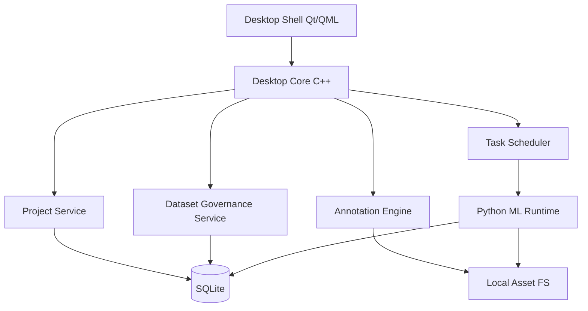

# 系统架构总览 v2

## 1. 总体架构

标炬采用“本地桌面主进程 + Python 训练后端子系统 + 元数据数据库 + 文件资产仓库”的混合架构。

## 2. 进程边界

### 2.1 主进程

主进程负责：

1. 桌面应用生命周期。
2. 页面导航。
3. 标注画布和交互。
4. 任务调度。
5. 本地数据库访问协调。

### 2.2 Python 后端进程

Python 进程负责：

1. 训练。
2. 推理。
3. 模型导出。
4. 训练日志转换与指标提取。
5. 模型生态适配。

### 2.3 辅助任务进程

可选独立子进程：

1. 缩略图生成。
2. 大规模导入扫描。
3. 导出验证。

## 3. 桌面主程序分层

### 3.1 Presentation Layer

负责：

1. 页面布局。
2. 用户输入。
3. 可视化反馈。
4. 资源状态展示。

### 3.2 Application Layer

负责：

1. 用例编排。
2. 流程控制。
3. 事务边界。
4. 权限虽然简单，但保留操作合法性控制。

### 3.3 Domain Layer

负责：

1. 业务实体。
2. 规则约束。
3. 状态机。

### 3.4 Infrastructure Layer

负责：

1. SQLite。
2. 文件系统。
3. IPC。
4. 日志系统。
5. 本地缓存系统。

## 4. 为什么必须进程隔离

1. 训练任务长时间运行且资源占用高。
2. PyTorch 或底层依赖异常不应拖垮主界面。
3. 推理和导出可能触发 GPU 或模型兼容性异常。
4. 混合架构下需要明确桌面核心与模型生态边界。

## 5. 任务调度原则

1. 训练、推理、导出均视为任务。
2. 任务应具备唯一 id、状态、日志流、结果路径。
3. 长任务必须支持取消、失败标记、恢复信息。

## 6. 架构演进原则

1. 任何新增训练后端必须走适配器层。
2. 任何新增标注类型必须走统一几何内核。
3. 任何新增导出格式必须走导出注册表。
