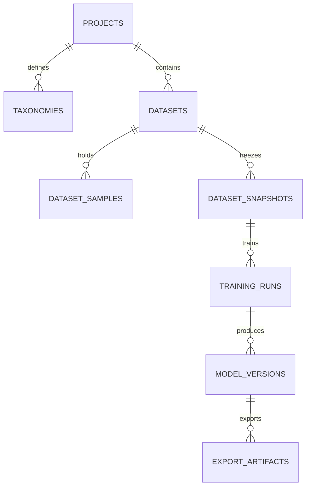

# 标炬（LabelTorch）技术架构与设计规范文档

> 版本：3.0 | 更新日期：2026-05-30
> 状态：架构蓝图与设计规范确立

---

## 一、 系统整体架构 (React + Electron/Tauri + Python)

为了确保高性能的标注体验（前端）与高算力的深度学习训练（后端）相结合，同时保障桌面的流畅性和高稳定性，标炬平台采用**“桌面壳体 + Web 前端 + 独立 Python 后端服务”**的混合进程架构。

```
┌────────────────────────────────────────────────────────────────────────┐
│                                                                        │
│                      Electron / Tauri 桌面宿主进程                        │
│                                                                        │
│  ┌───────────────────────┐                  ┌───────────────────────┐  │
│  │     Web 渲染进程       │                  │      主控制进程       │  │
│  │                       │                  │                       │  │
│  │   React + TypeScript  │  IPC (Renderer)  │   管理窗口生命周期     │  │
│  │   Tailwind CSS        │◄────────────────►│   SQLite 3 数据库连接 │  │
│  │   Fabric.js 画布      │                  │   系统 IO / 文件夹选择 │  │
│  └───────────────────────┘                  └───────────────────────┘  │
│                                                         ▲              │
└─────────────────────────────────────────────────────────┼──────────────┘
                                                          │ 
                                                          │ IPC (QProcess/Subprocess)
                                                          │ stdin / stdout JSON-RPC
                                                          ▼
┌────────────────────────────────────────────────────────────────────────┐
│                                                                        │
│                        Python 计算进程 (本地离线)                        │
│                                                                        │
│  ┌──────────────────────────────────────────────────────────────────┐  │
│  │  FastAPI / JSON-RPC Server (异步消息队列监听)                      │  │
│  └──────────────────────────────────────────────────────────────────┘  │
│      ├── Ultralytics Adapter (YOLOv5, YOLOv8, YOLOv10, YOLOv11)        │
│      ├── Anomalib Adapter (PatchCore, PADIM, EfficientAD 等)            │
│      └── ONNX / TensorRT 推理与验证引擎                                  │
│                                                                        │
└────────────────────────────────────────────────────────────────────────┘
```

### 1. 进程职责分工

#### A. Electron/Tauri 宿主进程 (Main Process)
* **生命周期管理**：负责桌面的启动、关闭、崩溃检测、多窗口管理。
* **文件系统桥接**：提供安全的本地文件读写、文件夹选择器接口，突破浏览器沙箱限制。
* **SQLite 3 管理**：运行本地关系数据库，记录项目、数据集、标注版本和模型元数据。
* **Python 子进程托管**：负责拉起 Python 环境，监听其健康状态，并在异常崩溃时自动拉起重启。

#### B. Web 前端渲染进程 (Renderer Process)
* **界面呈现**：采用 React + Tailwind CSS 构建，基于 Ant Design 与 Shadcn UI 提供一致的深色工业级 UI 主题。
* **交互画布 (Canvas)**：基于 Fabric.js / Konva.js 构建，在 CPU/GPU 混合模式下渲染图像、标注矩形框、旋转矩形框以及多边形。
* **数据流管理**：使用 Redux Toolkit 或 Zustand 维护前端全局状态。

#### C. Python 计算子进程 (Python Subprocess)
* **无状态计算服务**：不保存项目元数据，只接受主进程发送的计算任务指令（如：开始训练、划分数据集、推理图片、转换模型格式）。
* **依赖隔离**：采用内置绿色版 Python 运行时环境，预安装 PyTorch、CUDA 运行时库、Ultralytics 等。

---

## 二、 IPC 通信协议与契约 (JSON-RPC 2.0)

主控制进程与 Python 计算进程之间通过 `stdin` 和 `stdout` 进行 JSON-RPC 2.0 格式的数据流通信，确保平台的可移植性与网络解耦。

### 1. 消息协议格式

#### 请求格式 (Electron/Tauri → Python)
```json
{
  "jsonrpc": "2.0",
  "method": "train.start",
  "params": {
    "task_id": "run_20260530_0001",
    "adapter": "ultralytics_yolov8",
    "dataset_snapshot_path": "D:/DL/snapshots/snap_v1",
    "epochs": 200,
    "batch_size": 8,
    "learning_rate": 0.01,
    "device": "cuda:0"
  },
  "id": "req_101"
}
```

#### 响应格式 (Python → Electron/Tauri)
```json
{
  "jsonrpc": "2.0",
  "result": {
    "status": "training_initialized",
    "pid": 8944
  },
  "id": "req_101"
}
```

#### 异步事件通知 (Python → Electron/Tauri)
```json
{
  "jsonrpc": "2.0",
  "method": "task.progress",
  "params": {
    "task_id": "run_20260530_0001",
    "epoch": 12,
    "total_epochs": 200,
    "metrics": {
      "loss": 0.042,
      "mAP50": 0.942,
      "mAP50-95": 0.713,
      "precision": 0.915,
      "recall": 0.887
    }
  }
}
```

---

## 三、 SQLite 3 关系型元数据库设计

本地数据库存储于系统 `AppData/LabelTorch/labeltorch.db`，采用 WAL（Write-Ahead Logging）模式以保证高并发下的写稳定性。

### 1. 核心表结构定义



#### A. 项目表 (`projects`)
| 字段名 | 类型 | 约束 | 说明 |
| :--- | :--- | :--- | :--- |
| `id` | VARCHAR(36) | PRIMARY KEY | 项目UUID |
| `name` | VARCHAR(128) | NOT NULL | 项目名称 |
| `root_path` | TEXT | NOT NULL | 本地工作区绝对路径 |
| `task_type` | VARCHAR(32) | NOT NULL | 任务类型：detect / obb / classify / anomaly |
| `created_at` | TIMESTAMP | DEFAULT CURRENT_TIMESTAMP | 创建时间 |

#### B. 数据集样本表 (`dataset_samples`)
| 字段名 | 类型 | 约束 | 说明 |
| :--- | :--- | :--- | :--- |
| `id` | VARCHAR(36) | PRIMARY KEY | 样本UUID |
| `dataset_id` | VARCHAR(36) | FOREIGN KEY | 所属数据集ID |
| `image_path` | TEXT | NOT NULL | 图像绝对/相对路径 |
| `label_path` | TEXT | NULL | 对应的标注txt文件路径 |
| `width` | INTEGER | NOT NULL | 分辨率宽度 |
| `height` | INTEGER | NOT NULL | 分辨率高度 |
| `validation_status` | VARCHAR(16) | DEFAULT 'unverified' | 数据校验状态：unverified / verified / error |
| `split` | VARCHAR(16) | DEFAULT 'train' | 数据集划分配比：train / val / test |

#### C. 数据快照表 (`dataset_snapshots`)
* **设计意图**：实现标注与训练的隔离。快照一经生成便不可修改，训练阶段必须读取快照清单。
* **物理机制 (TXT List)**：生成快照时，系统绝不物理拷贝原始图像，而是根据数据集划分逻辑，在项目快照目录（如 `snapshots/{snapshot_id}/`）下自动生成 `train.txt`、`val.txt` 及 `test.txt`。这些文件内写入对应图片的绝对物理路径（一行一个路径），并自动生成指向这三个 txt 文件的 YOLO `data.yaml` 配置文件。这在 Windows 环境下完全避开了文件复制的磁盘开销与符号链接所需的管理员权限阻碍。
| 字段名 | 类型 | 约束 | 说明 |
| :--- | :--- | :--- | :--- |
| `id` | VARCHAR(36) | PRIMARY KEY | 快照UUID |
| `dataset_id` | VARCHAR(36) | FOREIGN KEY | 关联数据集ID |
| `sample_manifest_json` | TEXT | NOT NULL | 包含的图片路径及坐标哈希快照列表 |
| `taxonomy_version` | VARCHAR(32) | NOT NULL | 类别体系版本 |
| `created_at` | TIMESTAMP | DEFAULT CURRENT_TIMESTAMP | 创建时间 |

#### D. 训练任务运行表 (`training_runs`)
| 字段名 | 类型 | 约束 | 说明 |
| :--- | :--- | :--- | :--- |
| `id` | VARCHAR(36) | PRIMARY KEY | 任务UUID |
| `project_id` | VARCHAR(36) | FOREIGN KEY | 项目ID |
| `snapshot_id` | VARCHAR(36) | FOREIGN KEY | 关联数据集快照ID |
| `config_snapshot_json` | TEXT | NOT NULL | 训练超参JSON快照 |
| `status` | VARCHAR(32) | NOT NULL | 状态：draft / running / succeeded / failed / stopped |
| `log_uri` | TEXT | NULL | 本地日志文件路径 |

---

## 四、 核心工作流设计边界

### 1. 标注修订历史与可恢复性机制 (Revisions)
* **规范**：每次标注保存，系统不在数据库中直接重写全部标注，而是将标注文件的 Diff 快照存入 `annotation_revisions` 表。
* **机制**：
  * 支持一键撤销（Undo）与重做（Redo）。
  * 引入审核记录（Audit trail），追踪每个人工确认的标注框，防止意外覆盖。

### 2. 多模型家族适配器模式 (TrainingAdapter)
Python 后端采用**策略模式 (Strategy Pattern)**，定义统一的抽象接口，方便后续零摩擦接入不同的 YOLO 系列与 Anomalib 系列算法：

```python
class TrainingAdapter(ABC):
    @abstractmethod
    def validate_config(self, config: dict) -> bool:
        """校验训练超参配置是否符合框架规范"""
        pass

    @abstractmethod
    def prepare_dataset(self, snapshot_manifest: dict) -> str:
        """为框架准备相应格式的数据集物理文件及 yaml 描述"""
        pass

    @abstractmethod
    def start_training(self, task_id: str, config: dict) -> None:
        """启动底层的物理训练进程"""
        pass

    @abstractmethod
    def stop_training(self) -> None:
        """优雅中断物理训练"""
        pass
```

### 3. 模型验证与发布守卫 (Export Validation Guard)
* 模型导出为 ONNX 后，系统并非直接报告成功，而是必须在 Python 后端拉起 `onnxruntime` 推理会话，传入一个标准的 Dummy Tensor，检测其输出的 Shape、量化层、激活状态是否正常。
* 验证通过后，方可将元数据中的 `export_artifacts.validation_result` 标记为 `verified`，并允许用户复制模型。

### 4. 任务生命周期看护与异常恢复 (Task Watchdog & Recovery)
* **实时健康监护 (Watchdog)**：主进程启动 Python 训练子进程后，必须获取子进程 PID 并存入当前会话。通过周期性轮询子进程状态，一旦子进程非正常死亡（如显卡 OOM、驱动崩溃 TDR），主进程立即捕获该事件，将训练状态置为 `failed`，释放锁定资源并弹出错误弹窗。
* **冷启动自动修正 (Cold Boot Auto-Stop)**：系统每次冷启动时，主进程必须自检 SQLite 数据库中状态为 `running` 的任务。如果其记录的 PID 在当前系统进程列表中已不存在，说明该任务在上次退出前发生了崩溃或程序被强退。系统应自动将其状态更新为 `stopped`，并在日志中追加记录“检测到程序异常中断”，以释放项目锁并允许用户在下次点击时进行断点续训。
