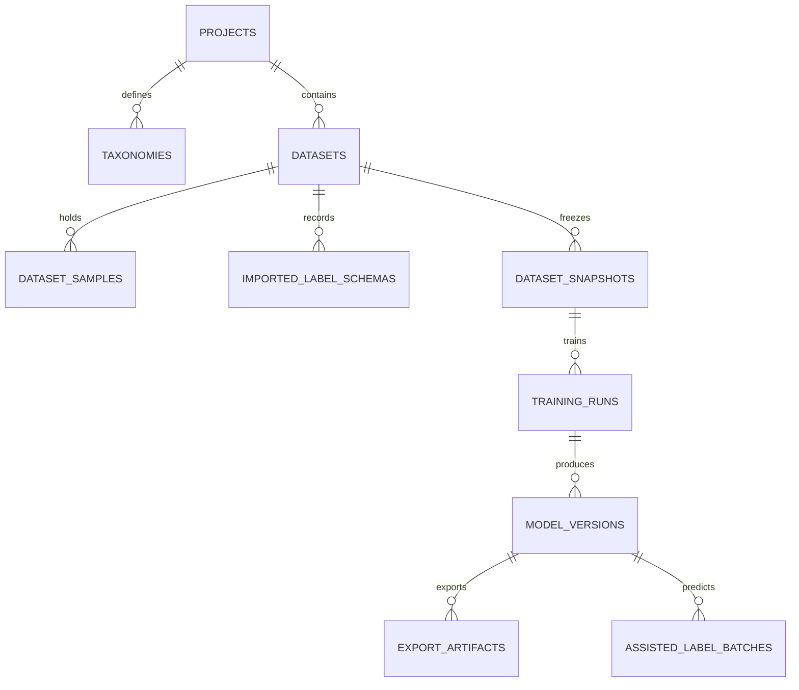

# 标炬（LabelTorch）技术架构与设计规范文档

> 版本：4.0 | 更新日期：2026-05-31
> 状态：架构确立（基于 Qt 6 + C++17 + QML + Python）

---

## 一、 系统整体架构 (Qt 6 + C++17 + QML + Python)

为了确保高性能的标注体验（前端）与高算力的深度学习训练（后端）相结合，同时保障桌面的流畅性和高稳定性，标炬平台采用**"Qt 桌面主进程 + QML 界面层 + 独立 Python 后端服务"**的混合进程架构。

```
┌────────────────────────────────────────────────────────────────────────┐
│                                                                        │
│                     Qt 6 桌面应用主进程 (C++17)                         │
│                                                                        │
│  ┌───────────────────────┐                  ┌───────────────────────┐  │
│  │   QML 渲染引擎        │                  │    C++ Service 层     │  │
│  │                       │                  │                       │  │
│  │   Qt Quick Controls 2 │ setContextProp.  │   ProjectService      │  │
│  │   Theme.qml 主题系统  │◄────────────────►│   DatasetService      │  │
│  │   QQuickPaintedItem   │                  │   TrainingService     │  │
│  │   画布渲染层          │                  │   ExportService       │  │
│  └───────────────────────┘                  │   AnnotationService   │  │
│                                              │   ... 等 7 大模块     │  │
│                                              │                       │  │
│                                              │   Database (SQLite 3) │  │
│                                              │   IpcClient (QProcess)│  │
│                                              └───────────────────────┘  │
│                                                         ▲              │
└─────────────────────────────────────────────────────────┼──────────────┘
                                                          │ 
                                                          │ QProcess 子进程
                                                          │ stdin / stdout JSON-RPC
                                                          ▼
┌────────────────────────────────────────────────────────────────────────┐
│                                                                        │
│                        Python 计算进程 (本地离线)                        │
│                                                                        │
│  ┌──────────────────────────────────────────────────────────────────┐  │
│  │  IpcServer (asyncio 异步消息队列监听 stdin/stdout)                 │  │
│  └──────────────────────────────────────────────────────────────────┘  │
│      ├── Ultralytics Adapter (YOLOv5, YOLOv8, YOLOv10, YOLOv11)        │
│      ├── Anomalib Adapter (PatchCore, PADIM, EfficientAD 等)            │
│      └── ONNX / TensorRT 推理与验证引擎                                  │
│                                                                        │
└────────────────────────────────────────────────────────────────────────┘
```

### 1. 进程职责分工

#### A. Qt 主进程 (C++17 + Qt 6.11)
* **生命周期管理**：负责桌面的启动、关闭、崩溃检测。
* **文件系统操作**：通过 `ProjectFs` 提供项目目录结构管理、文件夹选择器（`QFileDialog` / Qt Quick Dialogs）。
* **SQLite 3 管理**：通过 `Database` 单例运行本地关系数据库（WAL 模式），记录项目、数据集、标注版本和模型元数据。
* **Python 子进程托管**：通过 `IpcClient`（基于 `QProcess`）拉起 Python 环境，监听其健康状态，并在异常崩溃时自动重启（最多 5 次）。
* **Service 层**：7 大功能模块对应 7 个 C++ Service 类，通过 `setContextProperty` 注入 QML 层，QML 通过 `Q_INVOKABLE` 方法调用 Service 逻辑。

#### B. QML 界面渲染层 (Qt Quick)
* **界面呈现**：采用 Qt Quick Controls 2 构建，基于 `Theme.qml` 提供一致的深色工业级 UI 主题（深靛蓝+粉红强调色赛博蓝灰配色）。
* **交互画布 (Canvas)**：基于 `QQuickPaintedItem` + C++ OpenGL 渲染层构建，在 GPU 加速模式下渲染图像、标注矩形框、旋转矩形框以及多边形。
* **数据流管理**：使用 `Q_PROPERTY` + 信号槽机制管理前端状态，列表数据通过 `QAbstractListModel` 子类（如 `ProjectModel`、`DatasetModel`）提供。
* **页面导航**：主窗口 `Main.qml` 使用可折叠导航栏 + `StackLayout` 管理 7 个功能页面，支持 `Loader` 按需加载。

#### C. Python 计算子进程 (Python Subprocess)
* **无状态计算服务**：不保存项目元数据，只接受主进程发送的计算任务指令（如：开始训练、划分数据集、推理图片、转换模型格式）。
* **依赖隔离**：采用内置绿色版 Python 运行时环境（Conda 或嵌入式 Python），预安装 PyTorch、CUDA 运行时库、Ultralytics 等。

---

## 二、 IPC 通信协议与契约 (JSON-RPC over stdin/stdout)

主进程（C++ `IpcClient`）与 Python 计算进程（`IpcServer`）之间通过 `QProcess` 的 `stdin` 和 `stdout` 进行 JSON-RPC 格式的数据流通信，确保平台的可移植性与网络解耦。

### 1. 消息协议格式

#### 请求格式 (C++ → Python)
```json
{
  "type": "request",
  "request_id": "req_1_4521",
  "command": "train.start",
  "payload": {
    "run_id": "run_20260530_0001",
    "snapshot_id": "snap_v1",
    "config": {
      "adapter": "ultralytics",
      "model": "yolov8n",
      "data_yaml": "D:/DL/snapshots/snap_v1/data.yaml",
      "epochs": 200,
      "batch_size": 8,
      "learning_rate": 0.01,
      "device": "cuda:0"
    }
  },
  "timestamp": 1717027200
}
```

#### 响应格式 (Python → C++)
```json
{
  "type": "response",
  "request_id": "req_1_4521",
  "command": "train.start",
  "success": true,
  "result": {
    "status": "training_initialized",
    "pid": 8944
  },
  "error": {},
  "timestamp": 1717027201
}
```

#### 异步事件通知 (Python → C++)
```json
{
  "type": "event",
  "event_type": "task.progress",
  "task_id": "run_20260530_0001",
  "payload": {
    "epoch": 12,
    "total_epochs": 200,
    "loss": 0.042,
    "metrics": {
      "mAP50": 0.942,
      "mAP50-95": 0.713,
      "precision": 0.915,
      "recall": 0.887
    }
  },
  "timestamp": 1717027500
}
```

### 2. 命令集合

| 命令 | 方向 | 功能 |
|------|------|------|
| `environment.check` | C++ → Python | 环境检测（Python/PyTorch/CUDA/Ultralytics 版本） |
| `train.start` | C++ → Python | 启动训练任务 |
| `train.stop` | C++ → Python | 停止训练任务 |
| `train.status` | C++ → Python | 查询训练状态 |
| `train.list_adapters` | C++ → Python | 列出已注册的训练适配器 |
| `train.data_split` | C++ → Python | 数据集划分 |
| `inference.run` | C++ → Python | YOLO 模型推理（单张/批量） |
| `export.run` | C++ → Python | 模型导出 |
| `artifact.verify` | C++ → Python | 导出产物验证（ONNX Runtime 校验） |
| `anomaly.infer` | C++ → Python | 异常检测推理 |
| `active_learning.*` | C++ → Python | 主动学习系列命令 |
| `shutdown` | C++ → Python | 优雅关闭后端进程 |

### 3. 事件类型

| 事件 | 触发时机 |
|------|----------|
| `task.started` | 训练开始 |
| `task.progress` | 每个 epoch 结束（含 loss/mAP50/mAP50-95/precision/recall） |
| `task.log` | 训练日志 |
| `task.warning` | 训练警告 |
| `task.failed` | 训练失败 |
| `task.succeeded` | 训练成功（含 best_weight_path/last_weight_path/metrics） |
| `task.stopped` | 用户手动停止 |

---

## 三、 SQLite 3 关系型元数据库设计

本地数据库存储于 `QStandardPaths::AppDataLocation`（即 `AppData/LabelTorch/labeltorch.db`），采用 WAL（Write-Ahead Logging）模式以保证高并发下的写稳定性。

### 1. 核心表结构定义



#### A. 项目表 (`projects`)
| 字段名 | 类型 | 约束 | 说明 |
| :--- | :--- | :--- | :--- |
| `id` | TEXT | PRIMARY KEY | 项目UUID |
| `name` | TEXT | NOT NULL | 项目名称 |
| `root_path` | TEXT | NOT NULL UNIQUE | 本地工作区绝对路径 |
| `task_type` | TEXT | DEFAULT 'detect' | 任务类型：detect / obb / classify / anomaly |
| `default_device` | TEXT | DEFAULT 'auto' | 默认计算设备 |
| `default_model_family` | TEXT | DEFAULT 'yolov8' | 默认模型族 |
| `created_at` | DATETIME | DEFAULT CURRENT_TIMESTAMP | 创建时间 |
| `updated_at` | DATETIME | DEFAULT CURRENT_TIMESTAMP | 更新时间 |

#### B. 数据集样本表 (`dataset_samples`)
| 字段名 | 类型 | 约束 | 说明 |
| :--- | :--- | :--- | :--- |
| `id` | TEXT | PRIMARY KEY | 样本UUID |
| `dataset_id` | TEXT | FOREIGN KEY | 所属数据集ID |
| `image_path` | TEXT | NOT NULL | 图像路径 |
| `label_path` | TEXT | NULL | 对应的标注txt文件路径 |
| `width` | INTEGER | NULL | 分辨率宽度 |
| `height` | INTEGER | NULL | 分辨率高度 |
| `hash` | TEXT | NULL | 文件哈希 |
| `validation_status` | TEXT | DEFAULT 'valid' | 数据校验状态 |
| `split` | TEXT | DEFAULT 'train' | 数据集划分：train / val / test |
| `error_code` | TEXT | NULL | 错误码 |

#### C. 数据快照表 (`dataset_snapshots`)
* **设计意图**：实现标注与训练的隔离。快照一经生成便不可修改，训练阶段必须读取快照清单。
* **物理机制 (TXT List)**：生成快照时，系统绝不物理拷贝原始图像，而是根据数据集划分逻辑，在项目快照目录（如 `snapshots/{snapshot_id}/`）下自动生成 `train.txt`、`val.txt` 及 `test.txt`。这些文件内写入对应图片的绝对物理路径（一行一个路径），并自动生成指向这三个 txt 文件的 YOLO `data.yaml` 配置文件。这在 Windows 环境下完全避开了文件复制的磁盘开销与符号链接所需的管理员权限阻碍。

#### D. 训练任务运行表 (`training_runs`)
| 字段名 | 类型 | 约束 | 说明 |
| :--- | :--- | :--- | :--- |
| `id` | TEXT | PRIMARY KEY | 任务UUID |
| `project_id` | TEXT | FOREIGN KEY | 项目ID |
| `snapshot_id` | TEXT | FOREIGN KEY | 关联数据集快照ID |
| `config_snapshot_json` | TEXT | NOT NULL | 训练超参JSON快照 |
| `runtime_env_snapshot_json` | TEXT | NULL | 运行时环境JSON快照 |
| `status` | TEXT | NOT NULL DEFAULT 'draft' | 状态：draft / preparing / running / succeeded / failed / stopped |
| `log_uri` | TEXT | NULL | 本地日志文件路径 |
| `started_at` | DATETIME | NULL | 开始时间 |
| `finished_at` | DATETIME | NULL | 完成时间 |

> **完整的 14 张表 DDL 定义见 `src/core/database/Schema.cpp`。**

---

## 四、 核心工作流设计边界

### 1. 标注修订历史与可恢复性机制 (Revisions)
* **规范**：每次标注保存，系统不在数据库中直接重写全部标注，而是将标注文件的 Diff 快照存入 `annotation_revisions` 表。
* **机制**：
  * 支持一键撤销（Undo）与重做（Redo）。
  * 引入审核记录（Audit trail），追踪每个人工确认的标注框，防止意外覆盖。

### 2. 多模型家族适配器模式 (TrainingAdapter)
Python 后端采用**策略模式 (Strategy Pattern)**，定义统一的抽象接口，方便后续零摩擦接入不同的 YOLO 系列与 Anomalib 系列算法：

```python
class TrainingAdapter(ABC):
    @abstractmethod
    def validate_config(self, config: dict) -> bool:
        """校验训练超参配置是否符合框架规范"""
        pass

    @abstractmethod
    def prepare_dataset(self, snapshot_manifest: dict) -> str:
        """为框架准备相应格式的数据集物理文件及 yaml 描述"""
        pass

    @abstractmethod
    def start_training(self, task_id: str, config: dict) -> None:
        """启动底层的物理训练进程"""
        pass

    @abstractmethod
    def stop_training(self) -> None:
        """优雅中断物理训练"""
        pass

    @abstractmethod
    def export_model(self, weight_path: str, format: str, options: dict) -> dict:
        """导出模型"""
        pass
```

已实现的适配器：
* **UltralyticsAdapter**：支持 YOLOv5/v8/v8_obb/v8_cls/v10/v11
* **AnomalibAdapter**：支持 PatchCore/PADIM/EfficientAD 等（可选依赖，未安装时自动跳过注册）

### 3. 模型验证与发布守卫 (Export Validation Guard)
* 模型导出为 ONNX 后，系统并非直接报告成功，而是必须在 Python 后端拉起 `onnxruntime` 推理会话，传入一个标准的 Dummy Tensor，检测其输出的 Shape、量化层、激活状态是否正常。
* 验证通过后，方可将元数据中的 `export_artifacts.validation_result` 标记为 `verified`，并允许用户复制模型。

### 4. 任务生命周期看护与异常恢复 (Task Watchdog & Recovery)
* **实时健康监护 (Watchdog)**：`IpcClient` 启动 Python 后端子进程后，获取子进程 PID 并通过 `QProcess` 状态监控。`QProcess::finished` 信号一旦触发（非正常退出），立即将训练状态置为 `failed`，释放锁定资源并通过信号通知 QML 层弹出错误提示。
* **自动重启**：`IpcClient` 内置自动重启机制（最多 5 次），通过 `m_restartCount` 计数器控制。
* **冷启动自动修正 (Cold Boot Auto-Stop)**：系统每次冷启动时，主进程必须自检 SQLite 数据库中状态为 `running` 的任务。如果其记录的 PID 在当前系统进程列表中已不存在，说明该任务在上次退出前发生了崩溃或程序被强退。系统应自动将其状态更新为 `stopped`，并在日志中追加记录"检测到程序异常中断"，以释放项目锁并允许用户在下次点击时进行断点续训。

### 5. C++ Service 层设计规范
* 所有 Service 类继承 `QObject`，通过 `Q_INVOKABLE` 暴露方法给 QML 层
* Service 间依赖通过 `setXxx()` 方法注入，不使用全局变量
* 日志使用 `ltInfo(LT_LOG_XXX())` 宏，分模块分级别
* 所有 ID 使用 UUID（`QUuid::createUuid().toString(QUuid::WithoutBraces)`）
* 数据库操作使用 `Database::instance().database()` 获取连接
