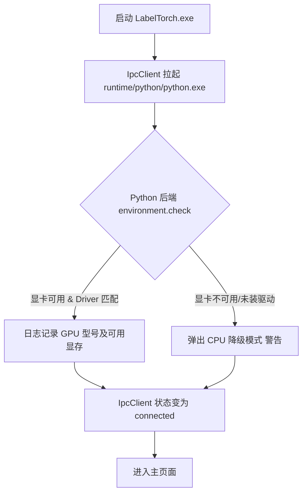

# 标炬（LabelTorch）工业级视觉平台技术与设计规范 (行业标准指南)

> 版本：2.0 | 更新日期：2026-05-31
> 状态：行业设计与规范标准确立（基于 Qt 6 + C++17 + QML + Python）

本规范旨在将工业视觉检测行业的成熟标准、交互逻辑及部署方案深度融入"标炬（LabelTorch）"的设计中，涵盖数据契约、UI/UX 交互与快捷键、算法指标可视化、离线绿色包依赖打包、以及增量训练与难例检测（主动学习）工作流。

---

## 一、 工业级数据规范与格式契约 (Data Contracts)

在工业缺陷检测中，格式统一是算法闭环的关键。标炬对常用标注格式进行严格标准化定义：

### 1. YOLO 目标检测 (HBB - Horizontal Bounding Box)
* **标签路径**：与图像同目录或单独的 `labels/` 目录下同名 `.txt` 文件。
* **数据契约**：每行代表一个实例，以空格分隔。
  $$\text{[class\_id] [x\_center] [y\_center] [width] [height]}$$
  * `class_id`：从 `0` 开始的类别索引整数。
  * `x_center`, `y_center`：目标框中心点坐标归一化到 `[0.0, 1.0]`（相对图像宽度和高度）。
  * `width`, `height`：目标框的宽度与高度归一化到 `[0.0, 1.0]`。
* **验证规则**：所有的归一化坐标必须满足 $0.0 \le x, y, w, h \le 1.0$。若越界，`ImportScanner` 在扫描时自动发出警告，并在导入时限制归入异常池。

### 2. YOLO 旋转检测 (OBB - Oriented Bounding Box)
* **工业场景**：适用于倾斜的长条形缺陷、焊点、以及具有方向性的零部件标注。
* **数据契约 (YOLO OBB 归一化五点法)**：
  $$\text{[class\_id] [x1] [y1] [x2] [y2] [x3] [y3] [x4] [y4]}$$
  * 四个顶点的顺序为：**左上 -> 右上 -> 右下 -> 左下**。
  * 所有坐标归一化至 `[0.0, 1.0]`。
  * *备用格式*：部分工业算法也支持 DOTA 格式 $[x1, y1, x2, y2, x3, y3, x4, y4, \text{class\_name}, \text{difficulty}]$。系统需支持一键互转。
* **C++ 内核**：`RotatedBox` 类（`src/features/annotation/geometry/RotatedBox.h`）封装 OBB 的几何计算。

### 3. 分类任务 (Classification)
* **标签形式**：支持文件夹层级结构导入：
  ```
  dataset/
  ├── train/
  │   ├── scratch/         # 划痕类
  │   │   ├── img01.jpg
  │   │   └── img02.jpg
  │   └── dent/            # 凹坑类
  │       └── img03.jpg
  ```

### 4. 异常检测 (Anomaly Detection)
* **工业场景**：工业质检最常见的"零缺陷"或"极少缺陷样本"场景。
* **数据契约**：
  * **正常样本库**：仅包含正常工件图像，无需打标，存放于 `good/` 目录。
  * **测试/异常样本库**：包含异常工件图像，存放在 `bad/` 目录。若有像素级真实缺陷区域（Pixel-level Ground Truth），其掩膜（Mask）存放在同名黑白二值图（`.png`，缺陷为 `255`，背景为 `0`）中。

---

## 二、 工业级 UI/UX 交互与快捷键规范 (UI/UX & Keyboard Mapping)

工业标注需要极高的人效，键盘与鼠标的紧密配合是核心。

### 1. 画布交互（Canvas Operations）
* **缩放 (Zoom)**：`CanvasController` 支持以鼠标当前悬浮点为中心，进行滚轮缩放，步长为 $10\%$。
* **平移 (Pan)**：按下键盘 **`Space (空格键)`** + 鼠标左键拖拽画布；或按下鼠标中键拖拽。
* **自适应大小 (Zoom to Fit)**：双击鼠标中键，或按下 **`F`** 键，画布重置为居中适合窗口大小。
* **十字准星辅助线**：标注状态下，鼠标移动时显示水平和垂直的像素级对齐线，并实时显示光标处图像的 $(x, y)$ 物理像素坐标及 RGB 灰度值。

### 2. 快捷键映射表 (Keyboard Layout)

| 类别 | 快捷键 | 功能 |
| :--- | :--- | :--- |
| **画布控制** | `Space (长按)` | 切换至抓手平移模式 |
| | `F` / 双击中键 | 缩放至窗口合适大小 (Fit) |
| | `Ctrl + R` | 重置缩放与平移 (Reset) |
| **标注绘制** | `W` | 激活水平矩形标注工具 (HBB Box) |
| | `O` | 激活旋转矩形标注工具 (OBB Box) |
| | `P` | 激活多边形标注工具 (Polygon) |
| | `E` | 激活橡皮擦 / 笔刷工具 |
| | `ESC` | 取消当前绘制 / 返回选择模式 |
| **实例编辑** | `Delete` / `Backspace` | 删除选中标注实例 |
| | `Ctrl + Z` | 撤销上一步操作 (Undo) |
| | `Ctrl + Y` | 重做被撤销的操作 (Redo) |
| | `Ctrl + C` | 复制选中标注框 |
| | `Ctrl + V` | 粘贴标注框到当前图或下一张图 |
| **类别选择** | `1 ~ 9` | 快速将选中框赋予第 1 至 9 个类别 |
| **数据切换** | `A` / `D` / `◀` / `▶` | 切换到上一张图 / 下一张图 |
| | `Ctrl + S` | 手动保存当前标注（系统默认5秒无操作自动保存） |

**实现方式**：QML 层通过 `Keys.onPressed` 捕获快捷键事件，调用 `CanvasController` 的 `Q_INVOKABLE` 方法执行对应操作。

---

## 三、 工业模型评估指标与可视化规范 (Metrics Visualizations)

算法评估直接决定模型能否上线。标炬通过 `MetricService` 提供专业的评估数据。

### 1. 目标检测核心指标
* **精确率 (Precision)**：模型预测为缺陷的样本中，真实缺陷的占比。
* **召回率 (Recall)**：实际存在的缺陷中，被模型正确检出的比例。
* **F1-Score**：精确率与召回率的调和平均数：
  $$F1 = 2 \cdot \frac{\text{Precision} \cdot \text{Recall}}{\text{Precision} + \text{Recall}}$$
* **mAP@0.5**：在 IoU 阈值设为 0.5 时，所有类别平均精度（Average Precision）的均值。
* **mAP@0.5:0.95**：在 IoU 阈值从 0.5 到 0.95（步长为 0.05）的十个梯度下，mAP 的平均值（工业检测的核心参考指标）。

### 2. 异常检测核心指标 (Anomaly Detection)
* **Image-level AUROC**：图像级受试者工作特征曲线下面积。用于评估模型区分"OK/NG"整包分类的能力。
* **Pixel-level AUROC**：像素级曲线下面积。用于评估缺陷定位和热力图圈定物理缺陷边界的准确性。
* **PRO (Per-Region Overlap)**：按缺陷区域大小加权的重叠率。能更客观地评价微小 defects 的检出率。

### 3. 可视化图表
* **PR 曲线图**：使用 QML Canvas 或 C++ QPainter 绘制不同置信度阈值下的 Precision 与 Recall 走向，并在交叉点标注最佳阈值推荐。
* **混淆矩阵热力图 (Confusion Matrix)**：展示类别之间的误检关系。行表示真实标签，列表示预测标签，对角线归一化高亮。
* **推理热力图 (Heatmap)**：
  * 对异常检测输出的异常分数，采用 **Jet** / **Viridis** 色度图在原图之上进行叠加。
  * 图像附带阈值调整滑块，滑动可实时改变异常边界的二值化轮廓，直观展示漏检/误检的边界。

---

## 四、 离线绿色包依赖与打包机制 (Portable Distribution)

为解决工业控制计算机（工控机）无法连接外网且硬件驱动不一的问题，必须采用"沙箱一体化环境"打包策略。

### 1. 打包结构目录 (Bundle Layout)
```
LabelTorch_v1.0.0_win64/
├── LabelTorch.exe                 # Qt 6 桌面主程序
├── Qt6Core.dll                    # Qt 运行时库
├── Qt6Quick.dll
├── Qt6Sql.dll
├── ...                            # 其他 Qt 依赖 DLL
├── qml/                           # QML 模块
├── plugins/                       # Qt 插件（sqldrivers/imageformats 等）
├── database/                      # 初始 SQLite db 文件
└── runtime/                       # 一体化绿色运行时环境
    ├── python/                    # 嵌入式 Python 解释器 (3.11.x)
    │   ├── python.exe
    │   └── Lib/site-packages/     # 预装 PyTorch, CUDA runtime dlls, Ultralytics, OpenCV
    └── cuda/                      # 裁剪版的 CUDA 12.1 运行时依赖
        ├── cudart64_12.dll
        ├── cublas64_12.dll
        └── cudnn64_12.dll
```

### 2. 自动化启动与硬件自检流程 (Hardware Verification Guard)


* **显卡自检命令**：Python 后端 `environment.check` Handler 自动执行检测，将结果通过 JSON-RPC 返回给 `IpcClient`：
  ```python
  import torch
  cuda_available = torch.cuda.is_available()
  device_name = torch.cuda.get_device_name(0) if cuda_available else "None"
  vram = torch.cuda.get_device_properties(0).total_memory / (1024**3) if cuda_available else 0
  ```

---

## 五、 增量训练与主动学习工作流 (Incremental Training & Active Learning)

当生产线运行中出现"新缺陷"或"漏检例"时，如何快速将它们加入迭代闭环是降本增效的终极解决方案。

### 1. 主动学习 (Active Learning) 难例挖掘流程
1. **未标记图片流入**：将产线相机捕获的未打标工件图像，批量导入辅助标注池。
2. **多指标难例排序 (Active Sampling)**：通过 `ActiveLearningService` 实现：
   * **不确定度采样 (Least Confidence)**：模型预测出的所有缺陷框中，置信度在 `0.3 ~ 0.6` 之间的图像被优先排序。
   * **漏检高风险挖掘 (Entropy/Margin)**：使用两款不同模型（如 YOLOv8n 与 YOLOv8x）进行交叉验证。如果预测框数量不一致，该图自动归类为"高疑漏检图"。
3. **优先级队列**：在"数据检查"界面，AI 自动根据难例权重，将最紧急、对模型提升最有价值的图片推送到最前列，提示人工审核打标。

### 2. 增量训练与血缘链 (Model Lineage)
* **继承加载**：新建训练任务时，支持选择历史模型权重（例如 `models/v1.0_best.pt`）作为初始权重，继承已有的特征提取能力。通过 `model_versions.parent_model_version_id` 追踪血缘关系。
* **数据快照对齐**：通过 `SnapshotService` 锁定数据快照，每次增量训练都会在数据库中建立从属关系：
  $$\text{Model Version 2} \longleftarrow \text{Training Run 2} \longleftarrow \text{Snapshot 2 (Snapshot 1 + 新增难例批次)}$$
* 数据库自动绘制"模型进化谱系图"，方便用户在训练效果退化时，一键回滚到任意历史稳定版本。
