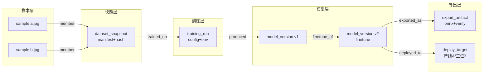

# 执行计划：v2.0.x 工业落地（实施级）

> 版本：2.0（实施级改写，可直接开工）
> 日期：2026-09-29
> 状态：待执行
> 前置基线：v1.1.x 增量与智能收口后；当前库 schema V4
> 执行环境：CPU / GPU 皆可；交付包与报告类验收必须在干净 Windows 10/11 虚拟机做
> 阅读方式：第 3 章是源码现状锚点，第 4~7 章按任务逐步实施，第 8 章迁移 SQL 可直接拷贝执行，附录 A~E 为字典 / 样例 / 图 / 目录树 / 回滚

---

## 1. 目标与非目标

### 1.1 目标

满足电池 / 3C / 金属表面缺陷产线的追溯与交付要求，让「模型交付给集成商」成为可审计、可追溯、可复现的标准动作：

1. **工业元数据**：样本级批次（lot_no）/ 料号（part_no）/ 工位（station）/ 相机（camera）/ 条码（barcode）/ 缺陷等级（defect_grade）落库，支持 CSV 旁路导入，按批次筛选与追溯。
2. **数据治理视图**：样本→快照→训练→模型→导出全链路血缘图、质量趋势时序、去重 / 合并 / 批量修标签工具。
3. **产线交付包**：IATF 风格审计报告、模型-产线映射（deploy_target）、完整部署目录一键产出（含校验清单与 zip）。
4. **可选项**：项目打包同步、只读审计导出（任务 H，资源允许时做）。

### 1.2 非目标（本期明确不做）

1. MES / SPC / PLC 实时对接（只做 CSV 等文件级旁路导入导出，不做在线协议）。
2. 多机协同编辑、权限系统、账号体系。
3. 新算法能力（分割、分类新模型等）。
4. 云端部署与远程推理服务。
5. 条码枪硬件驱动（只解析条码字符串字段）。

---

## 2. 与 v1.1 的依赖关系

| 依赖点 | 来自 v1.1 | 本计划用法 | 未就绪处置 |
|--------|-----------|------------|------------|
| 增量训练血缘 | `model_versions.parent_model_version_id` 父子链 | 血缘图「训练→模型」边 | 降级为快照→模型弱链，图上标「血缘不完整」 |
| 版本治理记录 | 晋级 / 回滚审计（task_events） | IATF「变更与批准记录」章节 | 章节留空并注明无治理记录 |
| 错误分析报告 | 自包含 HTML 报告骨架 | IATF 精度章节复用图表组件 | 只出结论表，不出失败案例 |
| 难例闭环数据 | 主动学习队列处理记录 | 质量趋势「难例处置率」曲线 | 去掉该曲线 |

依赖方向单向：v2.0 不反向要求 v1.1 改接口；接口有缺口在 v2.0 侧以适配层补齐并回写文档。

---

## 3. 源码现状锚点（动手前必读）

| 能力 | 位置 | 现状 |
|------|------|------|
| 表名常量 | `src/core/database/Schema.h:19-37` | 17 张表常量，无 `DEPLOY_TARGETS` |
| dataset_samples DDL | `src/core/database/Schema.cpp:45-56` | 仅 id/dataset_id/image_path/label_path/width/height/hash/validation_status/split/error_code，无工业元数据列 |
| 索引 | `src/core/database/Schema.cpp:222-282` | 16 条索引，无 lot/barcode/grade 索引 |
| 迁移机制 | `src/core/database/Database.cpp:106-207` | migrate() 顺序执行 V1→V2→V3→V4；`schema_version` 表追加式写入 |
| 新库版本戳 | `src/core/database/Database.cpp:252` | `INSERT INTO schema_version (version) VALUES (4)` —— V5 落地时必须同步改此处 |
| 版本读取 | `src/core/database/Database.cpp:257-267` | `SELECT version FROM schema_version ORDER BY version DESC LIMIT 1` |
| 样本列表 | `src/features/dataset/DatasetService.cpp:1309-1343` | listSamples 固定 SELECT 7 列，无筛选参数 |
| 样本插入 | `src/features/dataset/DatasetService.cpp:1361-1411` | insertSamples 写 7 列 + hash |
| 样本统计 | `src/features/dataset/DatasetService.cpp:752-798` | getSampleStats 按 validation_status / label_path 聚合 |
| 扫描器 | `src/features/dataset/ImportScanner.cpp:22` 起 | scan()/scanFolder() 输出 image/label 配对，无 CSV 概念 |
| 审计 | `src/core/utils/AuditLog.cpp:13-53`（record）、`:55-108`（listEvents） | 统一写 task_events，payload 为 JSON |
| 项目目录 | `src/core/filesystem/ProjectFs.cpp:79-134` | data/datasets/snapshots/taxonomy/revisions/models/versions/runs/exports/cache/thumbnails/logs |
| 导出主流程 | `src/features/export/ExportService.cpp:56`（exportModel）、`:257`（verifyExport） | pending→running→verifying→succeeded/failed |
| 报告导出 | `src/features/export/ExportService.cpp:509-591` | exportReport 目前只写 JSON（report_*.json），无 HTML |
| 交付目录 | `src/features/export/ExportService.cpp:928-1018` | getDeliveryDir/generateDeliveryPackage：`exports/delivery_<artifactId前8位>/`，含 model + classes.yaml + thresholds.json + eval_summary.json + warmup.py + infer_sample.py + manifest.json；**无**校验清单哈希、README、deploy_target.json、IATF 报告、zip |
| 原子写 | `src/features/export/ExportService.cpp:597-617` | writeFileAtomically（tmp+rename）必须复用 |
| 快照 manifest | `src/features/training/SnapshotService.cpp:213-238` | `[{"id","imageHash","labelHash"}]`，血缘样本边的唯一权威来源 |
| 指标 | `src/features/model/MetricService.h:20-78` | getMetricHistory / getRunMetrics，质量趋势直接复用 |
| 修订 | `src/features/annotation/AnnotationService.h:196` | createRevision 落 annotation_revisions，批量修标签必须走它 |
| 导出后端 | `backend/labeltorch_backend/handlers/export.py:12`（handle_run）、`:117`（handle_verify） | Python 侧导出与验证 |
| 导入后端 | `backend/labeltorch_backend/handlers/dataset.py` | 大表解析可下沉到此处 |
| 导航 / 孤页 | `src/shell/qml/Main.qml:148-157`（主导航）、`:177-182`（孤页 hiddenPages）、`:907-961`（14 个 Loader） | 新增 governance/trace 孤页要同时改 hiddenPages 与 Loader |
| 测试挂载 | `tests/CMakeLists.txt:9-19`（test_database） | 新测试按此模板 add_executable + add_test |
| 模块挂载 | `src/CMakeLists.txt:9-16` | 新增 features/governance 需 add_subdirectory |

---

## 4. 主任务 E：工业元数据

### E1 Schema V5 迁移与字段落库

**现状**：`Schema.cpp:45-56` 的 dataset_samples 无工业字段；`Database.cpp:106-207` 迁移链止于 V4；`DatasetService.cpp:1309` listSamples 与 `:1361` insertSamples 的 SELECT/INSERT 列清单写死。

**目标**：六个工业字段（lot_no / part_no / station / camera / barcode / defect_grade）落库可读写，旧库升级零丢失，既有导入链路不破坏（字段全部可空）。

**Schema V5 迁移 SQL**（完整可执行版见第 8 章；本任务相关子集）：

```sql
-- V5-1 样本工业元数据（全部可空，兼容旧数据）
ALTER TABLE dataset_samples ADD COLUMN lot_no TEXT;
ALTER TABLE dataset_samples ADD COLUMN part_no TEXT;
ALTER TABLE dataset_samples ADD COLUMN station TEXT;
ALTER TABLE dataset_samples ADD COLUMN camera TEXT;
ALTER TABLE dataset_samples ADD COLUMN barcode TEXT;
ALTER TABLE dataset_samples ADD COLUMN defect_grade TEXT;

-- V5-2 追溯与筛选索引
CREATE INDEX IF NOT EXISTS idx_samples_lot ON dataset_samples(dataset_id, lot_no);
CREATE INDEX IF NOT EXISTS idx_samples_barcode ON dataset_samples(dataset_id, barcode);
CREATE INDEX IF NOT EXISTS idx_samples_grade ON dataset_samples(dataset_id, defect_grade);
```

**逐步实现**：

1. `Schema.h`：不新增表常量（字段挂在既有 `DATASET_SAMPLES`）；注释里补一句字段语义。
2. `Schema.cpp`：在 dataset_samples 建表语句（45-56 行）末尾追加六列 `TEXT`；`createIndexStatements()`（222 行起）追加上述三条索引。
3. `Database.cpp`：
   - `migrate()` 在 V4 块之后追加 `if (version < 5)` 块：逐列 `ALTER TABLE ADD COLUMN`，每条用 `SELECT <col> FROM dataset_samples LIMIT 0` 探测是否已存在（照抄 V2→V3 的探测写法，Database.cpp:175-184），避免新库 DDL 已含列时重复 ALTER 报错；随后执行三条索引；最后 `INSERT INTO schema_version (version) VALUES (5)`。
   - `createTables()` 中版本戳（Database.cpp:252）改为 `VALUES (5)`。
   - 迁移前后计数自检：`SELECT COUNT(*) FROM dataset_samples / dataset_snapshots / model_versions`，不一致立即 return false，不写版本戳。
4. `DatasetService.cpp`：
   - `insertSamples`（1361）：INSERT 列表扩到 13 列，QVariantMap 里取 `lotNo/partNo/station/camera/barcode/defectGrade`，缺省写 NULL。
   - `listSamples`（1309）：SELECT 增加六列，返回 map 键名 camelCase（lotNo、partNo、station、camera、barcode、defectGrade），与既有 imagePath 命名一致。
   - `getSample` / `getSampleStats` 同步透出字段。
5. `AnnotationService::getSample`（AnnotationService.h:222）同样补列返回，避免详情页两套口径。
6. `YoloTxtReader/Writer`：**不改**。工业元数据走旁路列，标签文件格式保持 YOLO txt 不变（架构约束：标签文件可被外部工具直接消费）。

**测试用例**：
- T1-1 空库初始化后 `currentSchemaVersion()==5`，六列存在（PRAGMA table_info）。
- T1-2 构造 V4 旧库（手工建 V4 表 + 插 3 条样本 + 1 快照 + 1 模型版本），迁移后计数一致、六列全 NULL。
- T1-3 重复执行 migrate 幂等（第二次不报 duplicate column）。
- T1-4 insertSamples 带元数据写入 → listSamples 读回一致。
- T1-5 迁移前自动备份生成 `labeltorch.db.v4.bak`。

**验收命令**：

```powershell
cmake --preset msvc2022-release
cmake --build --preset msvc2022-release
ctest --preset msvc2022-release -R "DatabaseTest|DatasetHashTest|PerfIndexesTest|P1WorkflowTest" --output-on-failure
```

**常见坑**：
- SQLite 的 `ALTER TABLE ADD COLUMN` 不支持 `IF NOT EXISTS`，必须先探测（这是 V2→V3 已踩过的坑，照抄探测逻辑）。
- 新库由 `createTables()` 直接建含新列的表，此时 `migrate()` 里的 ALTER 会报 duplicate column——探测步骤不能省。
- 版本戳是**追加式**多行（Database.cpp:252/265），自检与回滚逻辑要按 `ORDER BY version DESC LIMIT 1` 的语义写，不要假设单行。
- Qt 6.11 Debug 下 NaN 断言问题（项目已知问题 16.1）：样本列表新增列绑定到 QML 时继续用 Theme 的 safeNum/safeSize 钳制数值列。

### E2 CSV 旁路导入

**现状**：`ImportScanner.cpp:22` 起只有目录扫描（scan/scanFolder/scanSeparate），`DatasetService` 导入族（importDataset/importDatasetJson/importDatasetV2/importDatasetSeparate 等，DatasetService.h:40-91）均为图片+标签目录模式；无 CSV 解析、无列映射 UI。

**目标**：CSV 旁路把产线 MES 导出的元数据灌进 dataset_samples；匹配失败可复查；重复导入策略可选；全程审计。

**CSV 导入列映射规范表**（向导默认映射，用户可改）：

| CSV 列名（常见别名） | 目标字段 | 类型 | 必填 | 校验规则 | 未通过处置 |
|----------------------|----------|------|------|----------|------------|
| `file_name` / `filename` / `图像名` | 匹配键：image_path 文件名 | TEXT | 二选一（file_name 或 barcode） | 大小写不敏感，允许带或不带扩展名 | 该行入错误报告 |
| `image_path` / `相对路径` | 匹配键：image_path 相对数据集 image_root 的路径 | TEXT | 否 | 规范化 `/` 与 `\` 后精确匹配 | 退化为文件名匹配 |
| `barcode` / `条码` / `sn` | 匹配键 3 + 落库 barcode | TEXT | 二选一 | 长度 ≤ 128，去首尾空白 | 落库截断并告警 |
| `lot_no` / `批次` / `batch` | lot_no | TEXT | 否 | ≤ 64，允许 `[A-Za-z0-9_\-\.]` | 非法字符替换为 `_` 并告警 |
| `part_no` / `料号` / `material` | part_no | TEXT | 否 | ≤ 64 | 同上 |
| `station` / `工位` | station | TEXT | 否 | ≤ 64 | 同上 |
| `camera` / `相机` / `cam` | camera | TEXT | 否 | ≤ 64 | 同上 |
| `defect_grade` / `缺陷等级` / `grade` | defect_grade | TEXT | 否 | 受控词表：`ok/good/defective/critical` 或客户自定义（导入时提示未登记取值） | 未登记值原样落库 + 提示 |
| 其余列 | 忽略 | — | — | — | 记入导入摘要「忽略列」 |

匹配键优先级（逐行）：**精确文件名 → 相对路径 → 条码字段**。条码匹配要求数据集内 barcode 已有值且唯一，否则跳过该级。

**逐步实现**：

1. **C++ 解析层**（推荐小表直解析、大表下沉 Python）：
   - `DatasetService.h` 新增 `Q_INVOKABLE QString importMetadataCsv(datasetId, csvPath, mappingJson, mode)`（mode：`fill_empty` 只填空 / `overwrite` 全量覆盖）与 `Q_INVOKABLE QVariantMap previewMetadataCsv(csvPath, mappingJson)`（返回表头、前 20 行预估、匹配率）。
   - `DatasetService.cpp` 用 `QTextStream` 逐行解析；支持 UTF-8 / GBK（探测 BOM，无 BOM 时按 GBK 重读失败再按 UTF-8）；分隔符自动嗅探 `,` / `;` / `\t`。
   - 千行以上走 `backend/labeltorch_backend/handlers/dataset.py` 新命令 `dataset.import_metadata_csv`：Python `csv` 模块解析后回传行数组，C++ 侧只做匹配与写库（写库必须在 C++ 事务里，保证与样本表一致）。
2. **写库**：`UPDATE dataset_samples SET lot_no=? ... WHERE dataset_id=? AND (文件名匹配 或 相对路径匹配 或 barcode=?)`；写前校验字段长度与非法字符；单事务批量提交，失败整批回滚。
3. **审计**：`AuditLog::record("dataset", datasetId, "metadata_csv_imported", payload)`，payload 含 csvPath、mode、总行数、匹配数、失败数、忽略列（AuditLog.cpp:13 签名照此调用）。
4. **错误报告**：未匹配 / 校验失败行写到 `{project}/logs/metadata_csv_errors_{时间戳}.csv`，列含原行号、原内容、失败原因，不中断整体导入。
5. **QML**：`DatasetBrowserPage.qml`（现仅 `:43` 调 listSamples）加「导入元数据 CSV」入口；新建 `MetadataCsvImportDialog.qml`：选文件 → 列映射（下拉绑定上方规范表的目标字段）→ 预览匹配率 → 选重复策略 → 确认。组件用 FormField / ModalDialog / ToastBus，全部 Theme 令牌。

**测试用例**：
- T2-1 列映射：别名列（`批次`→lot_no）正确落库。
- T2-2 匹配率：1000 行 CSV（800 文件名命中、100 路径命中、50 条码命中、50 未匹配）报告数值正确。
- T2-3 错误行报告文件生成且行号对应。
- T2-4 fill_empty 不覆盖已有值、overwrite 覆盖，两模式分别验证。
- T2-5 非法字符与超长字段被替换/截断且有告警。
- T2-6 GBK 编码 CSV 正确读入中文表头。
- T2-7 导入后 task_events 有 `metadata_csv_imported` 记录。

**验收命令**：

```powershell
ctest --preset msvc2022-release -R "P1WorkflowTest|DatasetHashTest" --output-on-failure
cd backend; python -m pytest tests/ -k "csv or metadata" ; python -m ruff check .
```

**常见坑**：
- Windows 路径分隔符：CSV 里的 `img\ok\a.jpg` 与库内 `img/ok/a.jpg` 必须规范化后再比对，否则匹配率虚低。
- 条码可能带前导零（`00781`），解析时禁止转数值，全程当字符串。
- CSV 大表一次性 `QVariantList` 进内存会拖垮 UI：超过 5000 行必须走 Python 分片回传。
- 重复导入幂等：同一批 CSV 连续导两次，fill_empty 模式第二次应 0 变更，作为用例写死。

### E3 按批次筛选与追溯

**现状**：`DatasetPage.qml:722` 已有 FilterBar（状态 / 划分筛选），`:1008` 用 `listSamples(dsId,0,500)` 前端过滤；`DatasetBrowserPage.qml:43` 分页拉样本。筛选全部在 QML 内存中做，无 SQL 级元数据筛选。

**目标**：批次 / 料号 / 工位 / 相机 / 缺陷等级筛选器（SQL 级，走 V5 新索引）；批次统计卡；一键跳转追溯页（F1）。

**逐步实现**：

1. `DatasetService`：`listSamples` 增加重载 `listSamplesFiltered(datasetId, filterMap, offset, limit)` 与 `getSampleCountFiltered(datasetId, filterMap)`；SQL 用参数绑定拼 `AND lot_no = ?` 等条件（只拼非空字段），排序仍 `ORDER BY image_path`，索引 `idx_samples_lot` 生效。
2. 批次统计：`Q_INVOKABLE QVariantMap getLotStats(datasetId, lotNo)`，一条 SQL 聚合样本量、defect_grade 分布、split 分布、标注完成率（复用 getSampleStats 的 labeled 判定口径，DatasetService.cpp:782-783）。
3. QML：`DatasetBrowserPage.qml` 顶部 FilterBar 扩展五个筛选输入（下拉取值来自 `SELECT DISTINCT`，上限 200 防爆）；批次卡显示统计；「追溯」按钮 `appController.currentPage = "trace"` 并传入 lotNo。
4. 万级样本性能：筛选查询必须 LIMIT/OFFSET 分页，禁止全量拉进 QML。

**测试用例**：
- T3-1 筛选结果与裸 SQL 直查逐条一致（注入 200 条混合批次样本）。
- T3-2 组合筛选（lot_no+defect_grade）正确。
- T3-3 万级样本下筛选计时 < 1s（QElapsedTimer 断言，参考 test_perf_indexes）。
- T3-4 空筛选退化为全量分页，行为与旧 listSamples 一致。

**验收命令**：

```powershell
ctest --preset msvc2022-release -R "PerfIndexesTest|P1WorkflowTest" --output-on-failure
```

**常见坑**：
- `dataset_id` 必须进每个筛选 SQL 的最左前缀，否则新索引（均以 dataset_id 起头）用不上。
- DISTINCT 取值查询对 lot_no 这类高基数字段要 LIMIT，防止下拉框装入十万项。
- 前端旧筛选（状态/划分）与新筛选是 AND 关系，QML 里别漏掉旧条件导致筛选结果偏大。

---

## 5. 主任务 F：数据治理视图

### F1 血缘图（样本→快照→训练→模型→导出）

**现状**：血缘数据已分散在各表——`dataset_snapshots.sample_manifest_json`（SnapshotService.cpp:213-238）持有样本 id 与哈希；`training_runs.snapshot_id`；`model_versions.run_id/parent_model_version_id`（Schema.cpp:114-126）；`export_artifacts.model_version_id`。但无聚合服务、无图形界面；`src/features/governance/` 目录不存在。

**目标**：LineageService 聚合出有向图；治理页 / 追溯页可视化；批次视角反查；断链可见。

**血缘图数据结构**：

```json
{
  "nodes": [
    { "id": "sample:<uuid>",        "type": "sample",   "label": "a.jpg",      "meta": {"lotNo": "...", "hash": "..."} },
    { "id": "snapshot:<uuid>",      "type": "snapshot", "label": "快照 2026-09-01", "meta": {"sampleCount": 1200} },
    { "id": "run:<uuid>",           "type": "run",      "label": "run #12",    "meta": {"status": "succeeded"} },
    { "id": "model:<uuid>",         "type": "model",    "label": "mv 0.91",    "meta": {"mAP5095": 0.91, "parent": "model:<uuid>|null"} },
    { "id": "export:<uuid>",        "type": "export",   "label": "onnx",       "meta": {"outputPath": "...", "status": "succeeded"} },
    { "id": "deploy:<uuid>",        "type": "deploy",   "label": "产线A/工位3", "meta": {"effectiveAt": "..."} }
  ],
  "edges": [
    { "from": "sample:<uuid>",  "to": "snapshot:<uuid>", "kind": "member",     "broken": false },
    { "from": "snapshot:<uuid>","to": "run:<uuid>",      "kind": "trained_on", "broken": false },
    { "from": "run:<uuid>",     "to": "model:<uuid>",    "kind": "produced",   "broken": false },
    { "from": "model:<uuid>",   "to": "model:<uuid2>",   "kind": "finetune_of","broken": false },
    { "from": "model:<uuid>",   "to": "export:<uuid>",   "kind": "exported_as","broken": false },
    { "from": "model:<uuid>",   "to": "deploy:<uuid>",   "kind": "deployed_to","broken": false }
  ],
  "incomplete": false
}
```

断链判定：任何一跳查空（快照被删、run_id 空、外部导入模型无 run）时保留占位节点，边 `broken:true`，节点灰色虚线，`incomplete:true`。

**聚合查询 SQL**（LineageService 内嵌，注意所有 id 都是 UUID 文本）：

```sql
-- 1) 某导出产物向上回溯到模型与训练与快照
SELECT e.id AS export_id, e.format, e.output_path, e.status AS export_status,
       m.id AS model_id, m.parent_model_version_id, m.metrics_snapshot_json,
       r.id AS run_id, r.status AS run_status, r.config_snapshot_json,
       s.id AS snapshot_id, s.sample_manifest_json, s.split_manifest_json
FROM export_artifacts e
LEFT JOIN model_versions m ON e.model_version_id = m.id
LEFT JOIN training_runs r ON m.run_id = r.id
LEFT JOIN dataset_snapshots s ON r.snapshot_id = s.id
WHERE e.id = :exportId;

-- 2) 快照 → 样本（manifest 展开在 C++ 做；此处取该数据集当前样本行补元数据）
SELECT ds.id, ds.image_path, ds.hash, ds.lot_no, ds.barcode, ds.defect_grade
FROM dataset_samples ds
WHERE ds.id IN ( :manifestSampleIds );

-- 3) 某批次反查进入过的快照与模型（产线追溯核心路径）
SELECT DISTINCT s.id AS snapshot_id, r.id AS run_id, m.id AS model_id, e.id AS export_id
FROM dataset_samples ds
JOIN dataset_snapshots s ON s.dataset_id = ds.dataset_id
JOIN training_runs r ON r.snapshot_id = s.id
LEFT JOIN model_versions m ON m.run_id = r.id
LEFT JOIN export_artifacts e ON e.model_version_id = m.id
WHERE ds.dataset_id = :datasetId AND ds.lot_no = :lotNo
  AND s.sample_manifest_json LIKE '%' || ds.id || '%';

-- 4) 模型父子链（增量训练血缘）
WITH RECURSIVE lineage(id, parent_model_version_id, depth) AS (
  SELECT id, parent_model_version_id, 0 FROM model_versions WHERE id = :modelId
  UNION ALL
  SELECT mv.id, mv.parent_model_version_id, l.depth + 1
  FROM model_versions mv JOIN lineage l ON mv.id = l.parent_model_version_id
)
SELECT * FROM lineage ORDER BY depth;

-- 5) 项目全图骨架（默认展开层，样本层按需下钻）
SELECT 'snapshot' AS t, s.id, s.dataset_id, s.created_at FROM dataset_snapshots s
JOIN datasets d ON s.dataset_id = d.id WHERE d.project_id = :projectId
UNION ALL
SELECT 'run', r.id, r.snapshot_id, r.started_at FROM training_runs r WHERE r.project_id = :projectId
UNION ALL
SELECT 'model', m.id, COALESCE(m.run_id, ''), m.created_at FROM model_versions m WHERE m.project_id = :projectId
UNION ALL
SELECT 'export', e.id, e.model_version_id, e.created_at FROM export_artifacts e
JOIN model_versions m2 ON e.model_version_id = m2.id WHERE m2.project_id = :projectId;
```

**逐步实现**：

1. 新模块 `src/features/governance/`：
   - `LineageService.h/.cpp`：`Q_INVOKABLE QVariantMap getLineage(rootType, rootId)`、`getLotLineage(datasetId, lotNo)`、`Q_INVOKABLE QVariantMap getNodeDetail(nodeType, nodeId)`。聚合结果就是上方 JSON 结构（QVariantMap/QVariantList 组装）。
   - `qml/GovernancePage.qml`：三 Tab（血缘 / 质量趋势 / 治理工具）。
   - `qml/LineageGraph.qml`：Canvas 或 Repeater+MouseArea 画分层有向图；节点按 sample/snapshot/run/model/export/deploy 分层横排；点击下钻；`broken` 边虚线灰色。默认展开上限 500 节点，超出按数据集/批次折叠（计数徽标），点击展开。
2. 挂载：`src/CMakeLists.txt:9-16` 后补 `add_subdirectory(features/governance)`；`Main.qml:177-182` hiddenPages 加 `{ pageId: "governance", title: "数据治理", parent: "dataset" }` 与 `{ pageId: "trace", title: "追溯", parent: "dataset" }`；`:907-961` Loader 区追加两个 Loader；`main.cpp` 实例化 LineageService 并 `setContextProperty`。
3. 追溯页 `qml/TracePage.qml`：纵向时间线（批次→样本→快照→训练→模型→导出），每层可展开列表，复用 LineageService。
4. 断链：查询命中 LEFT JOIN 空值时构造占位节点，`meta.reason` 写「快照缺失 / 无训练记录 / 外部导入模型」等。

**测试用例**：
- T4-1 完整链路：样本→快照→run→model→export 全连通，`incomplete=false`。
- T4-2 外部导入模型（run_id 空）显示 broken 边。
- T4-3 删除 training_runs 行后图上断链可见。
- T4-4 批次反查：注入 2 个批次，断言各自命中的 export 集合正确。
- T4-5 千节点构造耗时与返回体大小有上界（折叠后 ≤ 500 节点）。

**验收命令**：

```powershell
ctest --preset msvc2022-release -R "SnapshotTest|TrainingTest|ModelTest|ExportTest" --output-on-failure
```

**常见坑**：
- `sample_manifest_json` 是 JSON 数组（SnapshotService.cpp:214 新格式带哈希、旧格式纯 id 字符串），解析必须兼容两种（参照 SnapshotService::parseManifestHashes）。
- `LIKE '%' || ds.id || '%'` 对大 manifest 性能差：C++ 侧先把 manifest 解析成 QSet 再交集，SQL 只做粗筛。
- 递归 CTE 需 SQLite 3.8.3+，Qt 自带 SQLite 一般满足，但测试环境要显式验证 `sqlite3_libversion`。
- QML 画大图必须分层折叠，直接 Repeater 千节点会卡死（风险表既定项）。

### F2 质量趋势

**现状**：`MetricService.h:20-78` 已有 getMetricHistory / getRunMetrics（run_metrics 表 + task_events 回退，见架构约定 7.2）；无按批次 / 按日的缺陷率、返修率时序。

**目标**：时序聚合（按日 / 按批次），指标含缺陷率、标注返修率、mAP50-95、漏检率、难例处置率；可筛时间与批次；可导出 CSV；缺数据时段断点不补零。

**逐步实现**：

1. `LineageService`（或独立 `QualityTrendService`）新增 `Q_INVOKABLE QVariantList getQualityTrend(projectId, rangeJson)`。聚合 SQL 模板：

```sql
-- 缺陷率（按日，基于样本元数据导入/修订时间可得时；否则按批次聚合）
SELECT lot_no AS bucket,
       COUNT(*) AS total,
       SUM(CASE WHEN defect_grade IN ('defective','critical') THEN 1 ELSE 0 END) AS defect_cnt
FROM dataset_samples
WHERE dataset_id = :datasetId
GROUP BY lot_no;

-- 标注返修率（修订次数 / 样本数，按日）
SELECT DATE(ar.created_at) AS day,
       COUNT(*) AS revision_cnt,
       COUNT(DISTINCT ar.sample_id) AS touched_samples
FROM annotation_revisions ar
WHERE ar.dataset_id = :datasetId
GROUP BY DATE(ar.created_at);

-- 模型精度时序（mAP50-95，按 run 完成时间）
SELECT r.finished_at, rm.metric_value
FROM run_metrics rm JOIN training_runs r ON rm.run_id = r.id
WHERE rm.metric_name = 'metrics/mAP50-95(B)' AND r.project_id = :projectId
ORDER BY r.finished_at;
```

2. 图表复用 `MetricChart.qml` 令牌风格；时间范围 / 批次范围筛选器；「导出 CSV」按钮走 writeFileAtomically 落 `{project}/logs/`。
3. 难例处置率依赖 v1.1-B 的 `active_learning_items.status` 统计，未就绪则该序列不出（依赖表处置）。

**测试用例**：
- T5-1 聚合值与直查 SQL 对账（固定 30 条修订、10 个样本）。
- T5-2 中间缺日期的序列返回 null 断点而非 0。
- T5-3 批次范围筛选只含所选批次。

**验收命令**：`ctest --preset msvc2022-release -R "AuditLogTest|TrainingTest" --output-on-failure`

**常见坑**：metric_name 拼写按 Ultralytics 实际落库值（含 `(B)` 后缀），先 `SELECT DISTINCT metric_name FROM run_metrics` 确认再写死；日期聚合用 `DATE()` 时区按本地，跨时区数据先统一。

### F3 去重 / 合并 / 批量修标签

**现状**：hash 去重基础在 `DatasetService.cpp:1372-1401`（insertSamples 落 contentHash）与 `detectAnomalies`（:887）；修订追踪在 `AnnotationService::createRevision`（AnnotationService.h:196）；无合并向导、无批量改类/删框 API。

**目标**：三个治理工具，全部二次确认 + 审计 + 修订记录；不做一键撤销，按修订回放人工恢复。

**逐步实现**：

1. **去重**：`DatasetService::findDuplicateGroups(datasetId)` 按 `hash` 分组（`GROUP BY hash HAVING COUNT(*)>1`，走 idx_dataset_samples_hash）；QML 列出重复组，支持「保留最早 / 保留指定」，其余 `UPDATE dataset_samples SET validation_status='duplicate'`；出 split 泄漏检测报告（同 hash 跨 train/val 即泄漏）。审计 `AuditLog::record("dataset", datasetId, "dedup_applied", ...)`。
2. **合并**（同图不同标注）：`AnnotationService::mergeAnnotations(sampleId, keepSide)`，对比两侧框列表（before/after），择一保留或勾选混排；动作走 `createRevision` 写 `annotation_revisions`（before_snapshot_json 存被弃侧）。
3. **批量修标签**：`AnnotationService::batchRelabel(datasetId, filterJson, actionJson)`——按类别改类、按置信区间/批次删框；先 `previewBatchRelabel` 返回受影响样本数；危险操作 ConfirmDialog 默认聚焦取消；每个受影响样本一条 revision，batchId 串在 payload 便于回放。
4. QML：治理页第三 Tab `qml/GovernanceToolsPanel.qml`，三个子面板；空态 EmptyState；成功/失败 Toast。

**测试用例**：
- T6-1 去重后样本统计正确、duplicate 状态可见、泄漏报告指出跨 split 对。
- T6-2 合并产生 revision 且 before/after 可回放。
- T6-3 批量改类后每个样本有 revision，task_events 有 batch 记录。
- T6-4 预览计数与实际影响一致（防止预览-执行不一致）。

**验收命令**：`ctest --preset msvc2022-release -R "LabelIOAtomicTest|AuditLogTest|DatasetHashTest" --output-on-failure`

**常见坑**：批量写标签文件必须走 `YoloTxtWriter` 原子写（P0-4 约束），禁止手写 QFile 直出；deleteDataset 级联与 duplicate 标记互不干扰（validation_status 进过滤条件，SnapshotService.cpp:170 的 `IN ('valid','good','defective')` 会自动把 duplicate 排除出快照——这是期望行为，写进用例）。

---

## 6. 主任务 G：产线交付包

### G1 IATF 风格审计报告

**现状**：`ExportService::exportReport`（ExportService.cpp:509-591）只产出 JSON；交付目录里无报告文件；v1.1-C3 的 HTML 骨架在报告渲染侧可复用。

**目标**：自包含 HTML（零外链、打印友好，浏览器打印出 PDF）；报告文件哈希写入 `export_artifacts.validation_result`；离线可核对。

**IATF 报告章节模板**（HTML 结构，按序输出；章节可配置勾选）：

```text
封面：报告编号 / 项目名 / 模型版本 / 生成时间 / 报告版本号
1. 项目与数据来源
   1.1 项目信息（project.json 摘要：name/task_type/root_path 摘要哈希，不输出绝对路径）
   1.2 数据集清单（dataset id/名称/样本数/导入格式）
   1.3 工业元数据覆盖（批次/料号/工位/相机/条码/缺陷等级 有值率）
2. 类别体系版本
   2.1 taxonomy id / version / 类别定义表（类名、id、数量）
3. 数据快照清单
   3.1 快照 id / created_at / 样本数 / taxonomy_version / annotation_revision_boundary
   3.2 快照哈希摘要（sample_manifest 全量 SHA-256 的摘要 + 抽样 10 条 imageHash/labelHash）
4. 训练配置与运行环境
   4.1 config_snapshot_json（超参、模型族、设备）
   4.2 runtime_env_snapshot_json（Python/Torch/CUDA/Ultralytics 版本）
5. 评估结论
   5.1 精度：mAP50 / mAP50-95 / precision / recall（testing_runs.metrics_json）
   5.2 部署阈值（thresholds.json 同源）
   5.3 Go / No-Go 判定（阈值可配置；默认 mAP50-95 ≥ 0.85 且验证通过为 Go）
6. 导出产物验证结果
   6.1 artifact.verify 输出（格式、运行时、输出一致性）
   6.2 产物文件 SHA-256
7. 变更与批准记录
   7.1 晋级 / 回滚审计（task_events 中 promotion/rollback 事件）
   7.2 标注重大修订（annotation_revisions 按批次摘要）
   7.3 治理操作（去重/合并/批量修标签记录）
8. 生成信息
   8.1 LabelTorch 版本 / 报告模板版本 / 报告文件自身 SHA-256（自校验）
   8.2 签字栏（质量负责人 / 工艺负责人 留空供线下签）
```

**逐步实现**：

1. `ExportService` 新增 `Q_INVOKABLE QString generateIatfReport(artifactId)`：按上表从库内取数，用 QString 模板渲染 HTML（内嵌 CSS，@media print 规则，禁止任何 http 引用）；复用 `writeFileAtomically`（ExportService.cpp:597）落 `delivery_<id>/iatf_report.html`。
2. 报告文件自身 SHA-256（QCryptographicHash，参照 SnapshotService.cpp:67-82 的分块哈希）写入 `export_artifacts.validation_result`（JSON 追加 `reportSha256` 字段）。
3. 章节勾选配置：导出页提供勾选列表，默认全选；未选章节在报告目录中标注「本期未提供」。
4. `backend/handlers/export.py`：如需图表（PR 曲线）内嵌为 base64 PNG，在 Python 侧渲染后回传；否则纯 C++ 模板即可。

**测试用例**：
- T7-1 报告含 8 章标题，缺数据章节标注「本期未提供」而非缺章。
- T7-2 断网打开（离线）：用正则断言 HTML 内无 `http://`、`https://`、`src="//`。
- T7-3 报告哈希复验：重算文件 SHA-256 与 validation_result 内记录一致。
- T7-4 Go/No-Go 判定边界（mAP50-95 恰为阈值）。

**验收命令**：

```powershell
ctest --preset msvc2022-release -R "ExportTest|ExportVerifyTest" --output-on-failure
cd backend; python -m pytest tests/ -k "report or verify"; python -m ruff check .
```

**常见坑**：HTML 自包含意味着混淆矩阵/曲线必须内嵌 base64，注意单文件体积（>5MB 时降采样）；报告写入 `validation_result` 时该列已被 artifact.verify 使用，必须读-改-写合并 JSON，不能覆盖；打印分页用 `page-break-inside: avoid` 包表格，质量体系人员习惯打孔装订。

### G2 deploy_target 映射

**现状**：无 deploy_targets 表（Schema.h:19-37 无此常量）；导出流程（ExportService.cpp:56 exportModel）无部署目标概念；模型页无「已部署于」。

**目标**：产线 / 工位 / 相机 ↔ 模型版本映射可查可改可审计；同目标重复绑定保留历史；交付目录含 deploy_target.json。

**Schema V5 相关 SQL**（见第 8 章 V5-3）：

```sql
CREATE TABLE IF NOT EXISTS deploy_targets (
  id TEXT PRIMARY KEY,
  project_id TEXT NOT NULL REFERENCES projects(id),
  line_name TEXT NOT NULL,
  station TEXT,
  camera TEXT,
  model_version_id TEXT NOT NULL REFERENCES model_versions(id),
  effective_at DATETIME DEFAULT CURRENT_TIMESTAMP,
  note TEXT,
  created_by TEXT,
  status TEXT NOT NULL DEFAULT 'active'
);
CREATE INDEX IF NOT EXISTS idx_deploy_targets_proj ON deploy_targets(project_id, status);
CREATE INDEX IF NOT EXISTS idx_deploy_targets_model ON deploy_targets(model_version_id);
```

**逐步实现**：

1. `Schema.h` 加 `DEPLOY_TARGETS` 常量；DDL 进 `createTableStatements()`；迁移进 V5 块。
2. `ExportService`（或新 `DeployTargetService`）：`bindDeployTarget(projectId, modelVersionId, lineName, station, camera, note)`、`listDeployTargets(projectId)`、`unbindDeployTarget(id)`。绑定新版本时旧记录 `status` 改 `superseded`，**不删除**（历史保留），`AuditLog::record("deploy", id, "bound"/"superseded", ...)`。
3. 导出流程加「选择部署目标」步骤（ExportPage.qml）：选定后写映射，并在 generateDeliveryPackage 时写 `deploy_target.json`（line/station/camera/modelVersionId/effectiveAt）。
4. ModelPage.qml 加「已部署于」徽标（查 deploy_targets 当前 active）。

**测试用例**：
- T8-1 绑定→重绑后旧记录 status=superseded、新记录 active，历史可查。
- T8-2 交付目录含 deploy_target.json 且内容与库内一致。
- T8-3 解绑走审计、记录保留。

**验收命令**：`ctest --preset msvc2022-release -R "ExportTest|ModelTest" --output-on-failure`

**常见坑**：同一目标「唯一生效」语义靠查询 `WHERE status='active'` 而非唯一索引（历史要多行）；model_versions 删除时 deploy_targets 外键行为要显式处理（置 status=orphan 或拒绝删除），跟 ProjectService 级联策略对齐。

### G3 完整部署目录与交付 zip

**现状**：`generateDeliveryPackage`（ExportService.cpp:948-1018）已产出 model/classes.yaml/thresholds.json/eval_summary.json/warmup.py/infer_sample.py/manifest.json，目录名 `delivery_<artifactId前8位>`（:972）；**缺** SHA-256 校验清单、README、deploy_target.json、IATF 报告、zip 打包。

**目标**：补齐四件套并一键打包，集成商解压即可验收。

**部署交付目录清单树**（目标形态）：

```text
exports/delivery_<artifactId前8位>/
├── model.onnx                 # 或 model.pt / model.engine / model.tflite
├── classes.yaml               # 类别表（与 taxonomy 当前版本一致）
├── thresholds.json            # 部署阈值（conf/iou/分缺陷等级阈值）
├── eval_summary.json          # 评估摘要（精度、验证结论）
├── deploy_target.json         # 产线/工位/相机/生效时间（G2）
├── iatf_report.html           # IATF 审计报告（G1，自包含）
├── warmup.py                  # 预热脚本
├── infer_sample.py            # 推理样例
├── README.md                  # 部署步骤、环境要求、验收步骤、联系信息占位
├── manifest.json              # 既有清单（artifactId/modelVersionId/files/generatedAt）
└── checksums.sha256           # 校验清单：每行 "<sha256>  <相对路径>"，含上述除自身外全部文件
```

打包后：`exports/delivery_<artifactId前8位>.zip`（目录与 zip 同级，zip 内是同名文件夹）。

**逐步实现**：

1. `generateDeliveryPackage` 末尾追加：writeDeployTargetJson、（调用）generateIatfReport、writeReadme、writeChecksums。
2. `writeChecksums`：遍历目录（QDirIterator），逐文件分块 SHA-256（SnapshotService.cpp:67-82 哈希实现可抽到公共工具复用），按 `hash  相对路径`（两空格，sha256sum 兼容）排序写入，原子写。
3. README 内容：环境要求（Python 3.11+/onnxruntime 版本、CUDA 可选）、warmup 执行命令、infer_sample 执行命令、校验命令（`certutil -hashfile` 或 `Get-FileHash`）、故障排查（缺 DLL / 阈值调整）。
4. zip：Windows 下用 `QProcess` 调 PowerShell `Compress-Archive`，或引 Qt 不带 zip 时用 Python 后端命令 `export.pack_delivery`（推荐，backend/labeltorch_backend/handlers/export.py 扩展）。
5. ExportPage.qml 交付区块：「生成交付包」「打包 zip」「打开目录」「复制校验清单」按钮 + 校验结果列表。

**测试用例**：
- T9-1 目录文件清单与上树一致（11 项）。
- T9-2 checksums.sha256 全项复验通过（测试内重算比对）。
- T9-3 zip 解压后目录结构一致、校验清单仍通过。
- T9-4 干净虚拟机冒烟（手工）：解压 → `python warmup.py` → `python infer_sample.py` 跑通。

**验收命令**：

```powershell
ctest --preset msvc2022-release -R "ExportTest|ExportVerifyTest" --output-on-failure
# 干净虚拟机手工冒烟后，在校验清单目录执行：
Get-FileHash -Algorithm SHA256 model.onnx   # 与 checksums.sha256 比对
python warmup.py; python infer_sample.py
```

**常见坑**：checksums.sha256 不能含自身；zip 里用相对路径，禁止绝对路径（H1 同样约束）；Compress-Archive 对中文文件名在旧 PowerShell 上有编码坑，交付物文件名一律 ASCII；warmup/infer 脚本里模型文件名是 `model.<format>` 拼出来的（ExportService.cpp:981），改目录命名规则时两处要一起改。

---

## 7. 主任务 H（可选，视前序进度启动）

### H1 项目打包同步

**现状**：`ProjectFs`（ProjectFs.cpp:11-134）只负责建目录；ProjectService 有级联删除审计，无导出/导入。

**目标**：导出项目包（project.json + 标注与元数据 CSV + 快照 manifest + 可选数据本体），对端导入校验版本兼容；包内不含绝对路径。

**逐步实现**：

1. `ProjectService::exportProjectPackage(projectId, includeImages)`：产出
   `package/project.json`（根路径改写为相对）、`package/metadata.csv`（六个工业字段导出）、`package/snapshots/*.manifest.json`、`package/labels/`（YOLO txt 按相对路径还原）、`package/checksums.sha256`、可选 `package/images/`。
2. `ProjectService::importProjectPackage(zipPath, targetRoot)`：校验 checksums → 版本字段兼容（package_schema 1）→ 重建目录 → 灌库（复用 E2 写库事务）。
3. 审计：导出/导入各一条 task_events。

**测试**：T10-1 A 机导出 B 机导入后样本数/元数据/快照 manifest 哈希一致；T10-2 包被篡改时校验失败拒导入。工作量约 3.5 人日。

**常见坑**：路径改写要处理 Windows 盘符与 UNC；images 体积大时默认不打包，只打标签与元数据。

### H2 只读审计导出

**现状**：`AuditLog::listEvents`（AuditLog.cpp:55-108）已可按 taskType/taskId/limit 查；无批量导出。

**目标**：按时间范围导出只读审计包（task_events + annotation_revisions + 治理记录 + 哈希清单），离线可核验；导出动作自身留审计。

**逐步实现**：`ExportService::exportAuditPackage(projectId, from, to)` → `audit_pack/`（events.jsonl、annotation_revisions.jsonl、checksums.sha256、README）；zip 打包复用 G3 逻辑；`AuditLog::record("audit", projectId, "audit_pack_exported", ...)`。

**测试**：T10-3 时间范围边界含端点；T10-4 哈希可复验；T10-5 导出动作自身在包外库中留痕。工作量约 2 人日。

**常见坑**：jsonl 逐行 JSON 便于 diff 与流式核验，别用大 JSON 数组；payload_json 里可能含路径，导出前做敏感字段裁剪（密码类字段本就禁止入库）。

---

## 8. Schema V5 完整迁移 SQL（可直接执行）

迁移版本 V4 → V5，由 `Database::migrate()` 在启动时顺序执行，全程事务化；失败自动回滚并保留旧库可用。以下为权威脚本（与 C++ 迁移块保持逐句一致；手工执行前先备份）：

```sql
-- ============================================================
-- LabelTorch schema V4 -> V5 工业落地迁移
-- 前置：schema_version 最大版本为 4
-- 执行：事务包裹；任一步失败整体 ROLLBACK
-- ============================================================
BEGIN TRANSACTION;

-- V5-1 样本工业元数据（全部可空，兼容旧数据）
ALTER TABLE dataset_samples ADD COLUMN lot_no TEXT;
ALTER TABLE dataset_samples ADD COLUMN part_no TEXT;
ALTER TABLE dataset_samples ADD COLUMN station TEXT;
ALTER TABLE dataset_samples ADD COLUMN camera TEXT;
ALTER TABLE dataset_samples ADD COLUMN barcode TEXT;
ALTER TABLE dataset_samples ADD COLUMN defect_grade TEXT;

-- V5-2 追溯与筛选索引
CREATE INDEX IF NOT EXISTS idx_samples_lot ON dataset_samples(dataset_id, lot_no);
CREATE INDEX IF NOT EXISTS idx_samples_barcode ON dataset_samples(dataset_id, barcode);
CREATE INDEX IF NOT EXISTS idx_samples_grade ON dataset_samples(dataset_id, defect_grade);
CREATE INDEX IF NOT EXISTS idx_samples_station ON dataset_samples(dataset_id, station);

-- V5-3 产线部署映射
CREATE TABLE IF NOT EXISTS deploy_targets (
  id TEXT PRIMARY KEY,
  project_id TEXT NOT NULL REFERENCES projects(id),
  line_name TEXT NOT NULL,
  station TEXT,
  camera TEXT,
  model_version_id TEXT NOT NULL REFERENCES model_versions(id),
  effective_at DATETIME DEFAULT CURRENT_TIMESTAMP,
  note TEXT,
  created_by TEXT,
  status TEXT NOT NULL DEFAULT 'active'
);
CREATE INDEX IF NOT EXISTS idx_deploy_targets_proj ON deploy_targets(project_id, status);
CREATE INDEX IF NOT EXISTS idx_deploy_targets_model ON deploy_targets(model_version_id);

-- V5-4 版本戳
INSERT INTO schema_version (version) VALUES (5);

COMMIT;

-- 迁移后自检（人工或 C++ 内嵌）：三表计数应与迁移前快照一致
SELECT (SELECT COUNT(*) FROM dataset_samples) AS samples,
       (SELECT COUNT(*) FROM dataset_snapshots) AS snapshots,
       (SELECT COUNT(*) FROM model_versions) AS models,
       (SELECT COUNT(*) FROM training_runs) AS runs;
```

**C++ 侧差异说明**（脚本与代码对照，实现时以此为准）：

1. `Database::migrate()` 的 V5 块中，六条 ALTER 前各自做列探测（`SELECT <col> FROM dataset_samples LIMIT 0`），已存在则跳过——保证「空库升级 / 旧库升级 / 重复迁移」三条路径幂等（手工脚本默认目标是纯 V4 旧库，故可不带探测）。
2. 迁移前由启动逻辑自动备份：`labeltorch.db` → `labeltorch.db.v4.bak`（QFile::copy 完成后校验文件大小一致才算成功；失败则拒绝迁移）。
3. `Schema.h` 补 `DEPLOY_TARGETS = "deploy_targets"` 常量；`Schema.cpp` 的 createTableStatements / createIndexStatements 同步收录（新库直接 V5 形态）。
4. `createTables()` 版本戳（Database.cpp:252）改为 `VALUES (5)`。
5. 降级不支持：V5 库不允许被旧版本程序打开；旧程序读到 `version=5` 应在启动检查处明确报错（提示「请升级到 v2.0.x」），不得静默打开。

**迁移约束汇总**：备份必做、计数自检必过、幂等必测、失败不写版本戳、降级明确拒绝。

---

## 9. UI 页面规划

| 页面 | pageId | 类型 | 挂载位置 | 内容 |
|------|--------|------|----------|------|
| 数据治理页 | governance | 孤页 | 数据集页「治理」入口 | 血缘图 / 质量趋势 / 治理工具 三 Tab |
| 追溯页 | trace | 孤页 | 治理页 / 批次卡「追溯」入口 | 批次→样本→快照→训练→模型→导出 时间线 |
| 导出页扩展 | export | 既有主页 | 交付分组 | 部署目标 / IATF 报告 / 完整交付包（zip）区块 |
| 数据集浏览扩展 | dataset | 既有主页 | 数据分组 | 元数据列、批次筛选器、CSV 导入向导 |

交互约定：孤页标题栏显示「返回」面包屑（沿用 Main.qml:177-182 既有孤页规范）；治理操作一律二次确认 + 审计；空态走 EmptyState；颜色/字体/间距全走 Theme 令牌；界面文字仅中文。

---

## 10. 测试清单与验收命令汇总

| 编号 | 测试项 | 类型 | 验收命令 |
|------|--------|------|----------|
| T1 | V5 迁移幂等 / 旧库升级无损 / 备份生成 | C++ | `ctest -R "DatabaseTest"` |
| T2 | CSV 列映射 / 匹配率 / 错误行 / 重复导入策略 | C++ + Python | `ctest -R "P1WorkflowTest"` + `pytest -k csv` |
| T3 | 批次筛选对账 / 索引生效 | C++ | `ctest -R "PerfIndexesTest"` |
| T4 | 血缘聚合正确性 / 断链 / 下钻一致 | C++ | `ctest -R "SnapshotTest|ModelTest|ExportTest"` |
| T5 | 质量趋势聚合对账 / 断点 | C++ | `ctest -R "AuditLogTest|TrainingTest"` |
| T6 | 去重 / 合并 / 批量修标签审计与修订 | C++ | `ctest -R "LabelIOAtomicTest|AuditLogTest"` |
| T7 | IATF 章节完整性 / 哈希复验 / 离线可开 | Python + 手工 | `pytest -k report` + 断网打开 |
| T8 | deploy_target 唯一生效 / 历史保留 | C++ | `ctest -R "ExportTest|ModelTest"` |
| T9 | 交付包校验清单 / 干净虚拟机冒烟 | 手工 + 脚本 | `Get-FileHash` 比对 + warmup/infer |
| T10 | 项目包与审计包（可选项启动后） | C++ | 对应 test 扩展 |

**版本级总验收命令**：

```powershell
cmake --preset msvc2022-release
cmake --build --preset msvc2022-release        # 0 错 0 警
ctest --preset msvc2022-release --output-on-failure
cd backend; python -m pytest tests/; python -m ruff check .
```

版本级验收标准（5 条硬门槛）：
1. 追溯闭环：任一导出产物能回溯到样本集合，断链可见。
2. 元数据完整：六字段可导入/筛选/统计，旧库升级无损。
3. 交付就绪：zip 解压后干净虚拟机按 README 跑通 warmup 与推理样例。
4. 审计合规：IATF 报告过质量清单核对；治理操作全留痕。
5. 质量门禁：编译 0 错 0 警、ctest/pytest 全绿、ruff/qmllint 无新增问题、版本同步脚本通过、绿色包冒烟通过、CHANGELOG 与用户手册同步。

---

## 11. 常见坑总表（跨任务）

1. **SQLite ALTER 无 IF NOT EXISTS**：所有 ADD COLUMN 前必须列探测（Database.cpp:175 已有范式）。
2. **版本戳是追加多行**：currentSchemaVersion 取最大版本；迁移块判断用 `if (version < 5)` 且以 migrate() 开头读到的 version 为准（避免块间相互影响）。
3. **hash 双来源**：dataset_samples.hash 是导入时 contentHash（DatasetService.cpp:1373），快照 manifest 的 imageHash 是快照时点 SHA-256（SnapshotService.cpp:227）——血缘与校验用后者，去重用前者，别混。
4. **validation_status 受控词表**：快照只收 `valid/good/defective`（SnapshotService.cpp:170）；去重标记用 `duplicate`，自动被排除出快照，测试要覆盖。
5. **原子写**：所有配置/清单/报告/标签写入走 tmp+rename（ExportService.cpp:597、YoloTxtWriter）。
6. **审计不阻断主流程**：AuditLog::record 失败只记日志（AuditLog.cpp:24-26），但治理类操作的审计失败要在 UI Toast 提示。
7. **绝对路径泄漏**：IATF 报告、项目包、deploy_target.json 一律不落绝对路径（客户现场可反推目录结构）。
8. **QML 性能**：血缘图分层折叠（默认 500 节点上限）、样本列表必须分页 SQL、DISTINCT 下拉必 LIMIT。
9. **NaN 断言**（Qt 6.11 Debug）：新 QML 数值绑定沿用 Theme.safeNum/safeSize。
10. **Python 可选依赖**：CSV 大表下沉后端时，若走 pandas 则按可选依赖 try/except ImportError 处理；标准库 csv 足够，优先零依赖。
11. **编码**：CSV 兼容 GBK/UTF-8；日志与报告输出 UTF-8 无 BOM（HTML 里显式 `<meta charset="utf-8">`）。
12. **测试数据库隔离**：新测试照 test_database 模板用临时库路径，禁止碰真实 AppData 库。

---

## 12. 里程碑拆分（4~6 周）

> 总工作量约 29.5 人日（含可选项约 35 人日）。线 1：元数据 + 追溯（E+F1/F2）；线 2：治理 + 交付（F3+G）。第 4 周末主干不达出口则砍 H 保 M3。

| 里程碑 | 时间 | 交付内容 | 出口条件 |
|--------|------|----------|----------|
| M1 元数据地基 | 第 1~2 周 | E1、E2、E3；Schema V5 + T1~T3 | 旧库升级无损，CSV 导入与批次筛选可用 |
| M2 治理视图 | 第 2~4 周 | F1、F2、F3；governance/trace 上线 | 血缘闭环、质量趋势、三个治理工具可用；千节点不卡顿 |
| M3 产线交付 | 第 4~5 周 | G1、G2、G3 | zip 在干净虚拟机跑通；IATF 过质量清单 |
| M4 可选收口 | 第 5~6 周 | H1、H2（可选）；全量回归、文档、打包 | 版本级验收 1~5 全过，tag `v2.0.0`，CHANGELOG 与用户手册同步 |

---

## 13. 风险与应对

| 风险 | 影响 | 应对 |
|------|------|------|
| v1.1 血缘字段缺口 | 血缘图边不完整 | 适配层补齐 + 图上标「血缘不完整」，不阻塞发版 |
| 迁移伤及旧库 | 用户数据风险 | 迁移前备份 + 计数自检 + 幂等测试（T1） |
| 客户质量清单差异 | IATF 报告返工 | 章节可配置勾选，模板随交付迭代 |
| 大血缘图渲染性能 | 治理页卡顿 | 分层折叠 + 默认 500 节点上限 |
| 可选项膨胀拖垮工期 | 主干延期 | 第 4 周砍单点，H 系列一律可裁 |
| CSV 大表拖垮 UI | 导入卡死 | >5000 行走 Python 分片，C++ 只写库 |

---

# 附录

## 附录 A：dataset_samples 新字段字典

| 字段 | 类型 | 可空 | 约束 | 示例 | 说明 |
|------|------|------|------|------|------|
| lot_no | TEXT | 是 | ≤64，`[A-Za-z0-9_\-\.]` | `LOT20260901A` | 产线批次号；筛选与追溯主键之一 |
| part_no | TEXT | 是 | ≤64 | `PN-3C-0042` | 料号 / 物料编码 |
| station | TEXT | 是 | ≤64 | `ST-03` | 工位编号 |
| camera | TEXT | 是 | ≤64 | `CAM-TOP-01` | 相机标识 |
| barcode | TEXT | 是 | ≤128，保留前导零 | `007812345678` | 产品条码 / SN；可作匹配键 |
| defect_grade | TEXT | 是 | 受控词表：`ok/good/defective/critical`（可扩展） | `defective` | 缺陷等级；ok/good 计入非缺陷样本 |

通用约束：非法字符替换为 `_` 并记入导入告警；超长截断并告警；全部可空，不影响既有导入链路；查询必带 `dataset_id` 前缀。

## 附录 B：CSV 样例文件

`metadata_sample.csv`（UTF-8，逗号分隔，首行表头）：

```csv
file_name,barcode,lot_no,part_no,station,camera,defect_grade
ok_0001.jpg,007812345601,LOT20260901A,PN-3C-0042,ST-01,CAM-TOP-01,ok
ok_0002.jpg,007812345602,LOT20260901A,PN-3C-0042,ST-01,CAM-TOP-01,good
def_0011.jpg,007812345711,LOT20260901A,PN-3C-0042,ST-02,CAM-TOP-02,defective
def_0012.jpg,007812345712,LOT20260901B,PN-3C-0055,ST-03,CAM-SIDE-01,critical
img/ok/ok_0003.jpg,007812345603,LOT20260901B,PN-3C-0055,ST-03,CAM-SIDE-01,ok
```

说明：第 5 行用相对路径匹配；barcode 以 0 开头必须按文本读；未匹配行会进 `logs/metadata_csv_errors_*.csv`（列：原行号、原内容、失败原因）。

## 附录 C：血缘图结构说明（Mermaid）



节点/边类型与断链规则见第 5 章 F1 的 JSON 结构；`broken:true` 的边以灰色虚线渲染并在节点 meta.reason 标注原因。

## 附录 D：部署交付目录清单树

见第 6 章 G3 目标形态（11 项文件 + zip）。核对口径：

| 文件 | 来源 | 校验 |
|------|------|------|
| model.* | export.run 产物复制 | checksums.sha256 |
| classes.yaml | ExportService.cpp:619 writeClassesYaml | 同上 |
| thresholds.json | ExportService.cpp:669 writeThresholdsJson | 同上 |
| eval_summary.json | ExportService.cpp:703 writeEvalSummaryJson | 同上 |
| deploy_target.json | G2 新增 | 同上 |
| iatf_report.html | G1 新增 | 同上 + 自身哈希入 validation_result |
| warmup.py / infer_sample.py | ExportService.cpp:747/:817 | 同上 |
| README.md | G3 新增 | 同上 |
| manifest.json | ExportService.cpp:1002-1014 | 同上 |
| checksums.sha256 | G3 新增 | 自身不入清单 |

## 附录 E：迁移回滚策略

1. **备份**：迁移启动前 `labeltorch.db` → `labeltorch.db.v4.bak`（原子复制 + 大小校验）；备份已存在时追加序号（.v4.1.bak），永不覆盖旧备份。
2. **失败回滚**：V5 迁移块整体事务（BEGIN/COMMIT 包裹，异常路径 ROLLBACK）；失败不写版本戳，程序以「迁移失败，已回滚，库仍为 V4」报错退出，旧版本程序仍可打开。
3. **人工回滚**（极端场景）：关闭程序 → 删除（或改名）当前 `labeltorch.db` → 将 `labeltorch.db.v4.bak` 改名回 `labeltorch.db` → 用 v1.x 程序打开。注意 V5 期间新增的元数据/部署映射会随回滚丢失，回滚前先导出 CSV 旁路。
4. **禁止**：用旧版本程序直接打开 V5 库（版本检查必须拒绝）；在迁移过程中强杀进程（下次启动以备份+事务重试幂等恢复）。
5. **演练要求**：M1 里程碑内必须做一次完整回滚演练（升级→写入元数据→回滚→旧程序打开→再升级），演练记录进 CHANGELOG 附件。

---

## 附录 F：实施顺序建议（开工清单）

1. 第 0 天：通读本文件第 3 章源码锚点，核对行号与现状描述一致（代码演进后按符号名定位）。
2. 第 1~2 天：E1（Schema V5 + T1 测试），先绿迁移再动业务。
3. 第 3~5 天：E2 CSV 导入（含向导），T2。
4. 第 6~7 天：E3 筛选与批次统计，T3。
5. 第 2 周起并行：线 1 做 F1/F2 血缘与趋势；线 2 做 F3 治理工具与 G2 deploy_targets。
6. 第 4 周：G1 报告 + G3 交付包与 zip，T7~T9。
7. 第 5 周：干净虚拟机冒烟 + 版本级验收 + 文档（CHANGELOG、用户手册 01~06 对应章节）。
8. 资源富余才启动 H1/H2。

—— 全文完 ——
